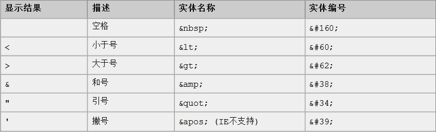
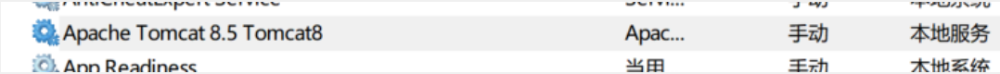
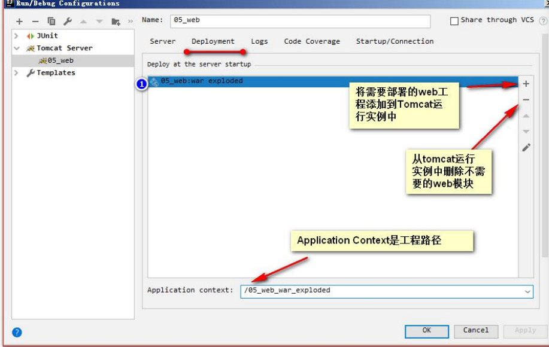

### 一、HTML和CSS

#### 1、网页的组成部分

```markdown
### 页面由三部分内容组成！
   分别是内容（结构）、表现、行为。
   
   - 内容（结构），是我们在页面中可以看到的数据。我们称之为内容。一般内容我们使用 html 技术来展示。
   
   - 表现，指的是这些内容在页面上的展示形式。比如说。布局，颜色，大小等等。一般使用
CSS 技术实现
   
   - 行为，指的是页面中元素与输入设备交互的响应。一般使用javascript 技术实现。
```

#### 2、HTML简介

```markdown
Hyper Text Markup Language （超文本标记语言） 简写：HTML
   HTML 通过标签来标记要显示的网页中的各个部分。网页文件本身是一种文本文件，
通过在文本文件中添加标记符，可以告诉浏览器如何显示其中的内容（如：文字如何处理，画
面如何安排，图片如何显示等）
```

#### 3、创建HTML文件（IDEA）

1，创建一个web工程（静态的web工程）

> file -> new -> Project -> static web ->static web -> next -> 工程名 ->finish
>
> (新版本的static web 就是用JavaScript)

2、在工程下创建html页面

> 右击工程 -> new -> html File 

3、编号html页面之后，点击浏览器框运行它

```powershell
注：Java 文件是需要先编译，再由 java 虚拟机跑起来。但 HTML 文件它不需要编译，直接由浏览器进行解析执行。
```


```html
<!DOCTYPE html> <!-- 约束，声明-->
<html lang="en"><!--html标签表示html的开始-->
           <!--lang="zh_CN"表示中文，en表示英文，html标签一般分为两个部分，分别是head和body-->
<head> <!--表示头部信息，一般包含三部分内容，title标签，css样式，js代码-->
    <meta charset="UTF-8"> <!--表示当前页面使用的是UTF-8字符集-->
    <title>Hello world</title> <!--表示标题-->
</head>
<body>  <!--body标签是整个html页面的主题内容， 在boyd后面可以加属性，比如bgcolor="red"-->
  Hello world
</body>
</html>

#### Html标准格式
<html>                      表示整个 html 页面的开始，html后面可以加语言的中英文
  <head>                    头信息开始
     <title>标题</title>             标题
  </head>                   头信息结束
  <body>                      body 是页面的主体内容
     页面主体内容
  </body>
</html>                     表示整个 html 页面的结束
```

> Html  的代码注释 <!-- 这是 html 注释，可以在页面右键查看源代码中看到 -->


#### 4、HTML标签的格式

- 1

- .标签的格式:
  <标签名>封装的数据</标签名>

- 2.标签名大小写不敏感。

- 3.标签拥有自己的属性。
     i. 分为基本属性： bgcolor="red" 可以修改简单的样式效果
     ii. 事件属性： onclick="alert('你好！');" 可以直接设置事件响应后的代码。

- 4.标签又分为，单标签和双标签。
  i. 单标签格式： <标签名 /> br 换行 hr 水平线
  ii. 双标签格式: <标签名> ...封装的数据...</标签名>

  


- 5、标签语法

  ```markdown
  ### <!-- ①标签不能交叉嵌套 -->
     正确：<div><span>早安，尚硅谷</span></div>
     错误：<div><span>早安，尚硅谷</div></span>
     <hr />
  
  ### <!-- ②标签必须正确关闭 -->
     1、<!-- i.有文本内容的标签： -->
       - 正确：<div>早安，尚硅谷</div>
       - 错误：<div>早安，尚硅谷
       <hr />
  
     2、<!-- ii.没有文本内容的标签： -->
       正确：<br />
       错误：<br>
       <hr />
   
     3、<!-- ③属性必须有值，属性值必须加引号 -->
       - 正确：<font color="blue">早安，尚硅谷</font>
       - 错误：<font color=blue>早安，尚硅谷</font>
       - 错误：<font color>早安，尚硅谷</font>
       <hr />
  
     4、<!-- ④注释不能嵌套 -->
       正确：<!-- 注释内容 --> <br/>
       错误：<!-- <!-- 这是错误的 html 注释 --> -->
       <hr />
   
  ### 注意事项：
     1.html 代码不是很严谨。有时候标签不闭合，也不会报错。
  ```

  

#### 5、常用的标签  帮助文档w3cschool.CHM

##### 1、font 字体标签 
需求 1示 ：在网页上显示 字体标签，并修改字体为  宋体，颜色为红色。

```html
<body>
  <!-- 字体标签
    需求 1 ：在网页上显示 我是字体标签 ，并修改字体为 宋体，颜色为红色。
    font 标签是字体标签 , 它可以用来修改文本的字体 , 颜色 , 大小 ( 尺寸 )
       color 属性修改颜色
       face 属性修改字体
       size 属性修改文本大小
   -->
   <font color="red" face=" 宋体" size="7">我是字体标签</font>
</body>
```

##### 2、特殊字符




> 空格是 HTML 中最普通的字符实体。
>
> 通常情况下，HTML 会裁掉文档中的空格。假如你在文档中连续输入 10 个空格，那么 HTML 会去掉其中的9个。如果使用  &nbsp;，就可以在文档中增加空格。

```php+HTML
<!-- &nbsp;-->怎么记，牛逼space
<body>
   <!-- 特殊字符
     需求 1 ：把 <br> 换行标签 变成文本 转换成字符显示在页面上
     常用的特殊字符 :最常用的就以下三个
     < ---=>>>> &lt;
     > ---=>>>> &gt;
     空格 --=>>>> &nbsp;
   -->
  我是&lt;br&gt;标签<br/>
  国哥好
  &nbsp;&nbsp;&nbsp;&nbsp;&nbsp;&nbsp;&nbsp;&nbsp;&nbsp;&nbsp;&nbsp;&nbsp;&nbsp;&nbsp;&nbsp;&nbsp;&nbsp;&nbsp;刷呀  <!- 一个&nbsp;代表一个空格，输入几个就有几个-->
    
</body>
```


##### 3、标题标签

标题标签是 h1 到 h6
      需求 1 ：演示标题 1 到 到 题 标题 6 的

```html
<!-- 属性align，用于设置标题文字的对齐方式，其取值如下：
	left：左对齐。
	right：右对齐。
	center：居中对齐。
-->


<body>
    <!-- 标题标签
      需求 1 ：演示标题 1 到 标题 6 的
      h1 - h6 都是标题标签
      h1 最大
      h6 最小
      align 属性是对齐属性
      left 左对齐 ( 默认 )
      center 剧中
      right 右对齐
     -->
  <h1 align="left">标题 1</h1>
  <h2 align="center">标题 2</h2>
  <h3 align="right">标题 3</h3>
  <h4>标题 4</h4>
  <h5>标题 5</h5>
  <h6>标题 6</h6>
  <h7>标题 7</h7> <!--这个标签不管用,没有h7-->
</body>
```

##### 4、超链接

需求：超链接

```html
<body>
   <!-- a 标签是 超链接
      href 属性设置连接的地址
        target 属性设置哪个目标进行跳转
         _self 表示当前页面 ( 默认值 )
         _blank 表示打开新页面来进行跳转
   -->
  <a href="http://www.baidu.com">百度</a><br/>
  <a href="http://www.baidu.com" target="_self">百度_self</a><br/>
  <a href="http://www.baidu.com" target="_blank">百度_blank</a><br/>
</body>
```

##### 5、列表标签

无序列表 、 有序列表

需求 1 ：使用无序，列表方式，把东北 F4赵四，刘能，小沈阳，宋小宝，展示出来

**无序列表**

```html
<body>
   <!-- 需求 1 ：使用无序，列表方式，把东北 F4 ，赵四，刘能，小沈阳，宋小宝，展示出来
     ul 是无序列表
       type 属性可以修改列表项前面的符号
        li 是列表项
   -->
  <ul type="none">
    <li>赵四</li>
    <li>刘能</li>
    <li>小沈阳</li>
    <li>宋小宝</li>
  </ul>
</body>
```

**有序列表**

```html
<!-- 各列表项按一定的编号顺序显示
	用<ol>开始，以</ol>结束
	每一个列表项用<li></li>标签定义
	语法：
	<ol>
   		<li>列表项1</li>
   		<li>列表项2</li>
  		 ……
	</ol>
在<ol>中可以使用type、start属性。type属性用于设置编号的种类，其取值如下：
	l：编号为数字，默认值。例如：1，2，3，……
	A：编号为大写英文字母。例如：A，B，C，……
	a：编号为小写英文字母。例如：a，b，c，……
	I：编号为大写罗马字符。例如：Ⅰ，Ⅱ，Ⅲ，……
	i：编号为小写罗马字符。例如：ⅰ，ⅱ，ⅲ，……

-->

<html>
    <head>
        <title>有序列表实例</title>
        <meta http-equiv="Content-Type" content="text/html; charset=UTF-8">
    </head>
    <body>
        Java工程师必备的技能：
        <hr>
        <ol type ="1">
            <li>Java程序设计</li>
            <li>JSP程序设计</li>
            <li>Java Web框架技术（Struts、Spring、Hibernate）</li>
            <li>Ajax</li>
            <li>Web服务器</li>
            <li>数据库技术</li>
            <li>项目开发经验</li>
        </ol>
        <hr>
    </body>
</html> 
```

**自定义列表**

```html
实现一种分两层的项目清单
语法：
<dl>
	<dt>第一个列表项</dt>
   <dd>对第一个列表项的说明</dd>
   <dt>第二个列表项</dt>
   <dd>对第二个列表项的说明</dd>
……
</dl>
用<dl>开始，以</dl>结束，给每一个列表项加上了一段说明性文字，说明性文字独立于列表项另起一行显示
<dt></dt>标签用来定义列表项
<dd></dd>标签用来对列表项进行说明
```

```html
<html>
    <head>
        <title>自定义列表实例</title>
        <meta http-equiv="Content-Type" content="text/html; charset=UTF-8">
    </head>
    <body>
       Java工程师必备技能要求：
       <hr>
       <dl>
           <dt>Java程序设计</dt>
           <dd>要求具有...</dd>
           <dt>JSP程序设计</dt>
           <dd>要求具有...</dd>
           <dt>Java Web框架技术（Struts、Spring、Hibernate）</dt>
           <dd>要求具有...</dd>
           <dt>Ajax</dt>
           <dd>要求具有...</dd>
           <dt>Web服务器</dt>
           <dd>要求具有...</dd>
           <dt>数据库技术</dt>
           <dd>要求具有...</dd>
           <dt>项目开发经验</dt>
           <dd>要求具有...</dd>
        </dl>
	<hr>
    </body>
</html> 

```


##### 6、照片

img 标签可以在 html 页面上显示图片。

需求 1 ：使用 img标签显示一张美女的照片，并修改宽高，和边框属性

```html
<body>
      <!-- 需求 1 ：使用 img 标签显示一张美女的照片。并修改宽高，和边框属性
         img 标签是图片标签 , 用来显示图片
           src 属性可以设置图片的路径
           width 属性设置图片的宽度
           height 属性设置图片的高度
           border 属性设置图片边框大小,一般为边框设置为1、2
           alt 属性设置当指定路径找不到图片时 , 用来代替显示的文本内容
       在 JavaSE 中路径也分为相对路径和绝对路径 .
          相对路径 : 从工程名开始算
          绝对路径 : 盘符 :/ 目录 / 文件名
       在 web 中路径分为相对路径和绝对路径两种
         相对路径 :（在IDEA中）
             . 表示当前文件所在的目录
             .. 表示当前文件所在的上一级目录
             文件名 表示当前文件所在目录的文件 , 相当于 ./ 文件名 ./ 可以省略 
         绝对路径 :
             正确格式是 : http://ip:port/ 工程名 / 资源路径
             错误格式是 : 盘符 :/ 目录 / 文件名
       -->
   
   
   
   
   
   
    
</body>
```

##### 7、表格标签

需求 1个 ：做一个 的 带表头的  ，三行，三列的表格，并显示边框

需求 2 ：修改表格的宽度，高度，表格的对齐方式，单元格间距。

```html
<body>
     <!--
      需求 1：做一个 带表头的 ，三行，三列的表格，并显示边框
      需求 2：修改表格的宽度，高度，表格的对齐方式，单元格间距。
        table 标签是表格标签
             border 设置表格标签
				width 设置表格宽度
				height 设置表格高度
				align 设置表格相对于页面的对齐方式
				cellspacing 设置单元格间距
		 tr 是行标签
       th 是表头标签
       td 是单元格标签
				align 设置单元格文本对齐方式
       b 是加粗标签
-->
	<table align="center" border="1" width="300" height="300" cellspacing="0">
		<tr>
			<td align="center"><b>1.1</b></th>   <!-- 一个针对单元格一个针对表头，等价th=此行所述 -->
			<th>1.2</th>
			<th>1.3</th>
		</tr>
		<tr>
			<td>2.1</td>
			<td>2.2</td>
			<td>2.3</td>
		</tr>
		<tr>
			<td>3.1</td>
			<td>3.2</td>
			<td>3.3</td>
		</tr>
	</table>
</body>
```

##### 8、跨行列表格标签

需求 1 ：新建一个五行，五列的表格，第一行，第一列的单元格要跨两列，第二行第一列的单元格跨两行，第四行第四列的单元格跨两行两列。

```html
<body>
		<!-- 需求 1：
		  新建一个五行，五列的表格，
		  第一行，第一列的单元格要跨两列，
		  第二行第一列的单元格跨两行，
		  第四行第四列的单元格跨两行两列。
  		 colspan 属性设置跨列
		 rowspan 属性设置跨行
		-->
	<table width="500" height="500" cellspacing="0" border="1">
		<tr>
			<td colspan="2">1.1</td>  <!-- 横跨表格的，多出来需要删除掉-->
			<td>1.3</td>
			<td>1.4</td>
			<td>1.5</td>
		</tr>
		<tr>
			<td rowspan="2">2.1</td>
			<td>2.2</td>
			<td>2.3</td>
			<td>2.4</td>
			<td>2.5</td>	
		</tr>
		<tr>
			<td>3.2</td>
			<td>3.3</td>
			<td>3.4</td>
			<td>3.5</td>
		</tr>
		<tr>
			<td>4.1</td>
			<td>4.2</td>
			<td>4.3</td>
			<td colspan="2" rowspan="2">4.4</td>
		</tr>
		<tr>
			<td>5.1</td>
			<td>5.2</td>
			<td>5.3</td>
		</tr>
	</table>
</body>
```

##### 9、iframe框架标签（内嵌窗口）

ifarme 标签它可以在一个 html 页面上,打开一个小窗口,去加载一个单独的页面.

```html
<body>
	我是一个单独的完整的页面<br/><br/>
	<!--ifarme 标签可以在页面上开辟一个小区域显示一个单独的页面
		ifarme 和 a 标签组合使用的步骤:且为双标签
			1 在 iframe 标签中使用 name 属性定义一个名称
			2 在 a 标签的 target 属性上设置 iframe 的 name 的属性值
               设置name可以通过超链接把超链接的内容放到内置窗口中。
	-->
	<iframe src="3. 标题标签.html" width="500" height="400" name="abc"></iframe>
	<br/>
	<ul>
		<li><a href="0- 标签语法.html" target="abc">0-标签语法.html</a></li>
		<li><a href="1.font  标签.html" target="abc">1.font 标签.html</a></li>
		<li><a href="2. 特殊字符.html" target="abc">2.特殊字符.html</a></li>
	</ul>
</body>
```

##### 10、表单标签

什么是表单?

表单就是 html 页面中,用来收集用户信息的所有元素集合.然后把这些信息发送给服务器.

> 需求 1: 创建一个个人信息注册的表单界面 。 包含用户名 ， 密码 ， 确认密码 。 性别 （ 单选 ） ， 兴趣爱好 （ 多选 ） ， 国籍 （ 下拉列表）。隐藏域，自我评价（多行文本域）。重置，提交。

```html
<body>
	<!--需求 1:创建一个个人信息注册的表单界面。包含用户名，密码，确认密码。性别（单选），兴趣爱好（多			  选），国籍（下拉列表）。隐藏域，自我评价（多行文本域）。重置，提交。
	-->
	<!--
		form 标签就是表单
      input type=text 是文件输入框 value 设置默认显示内容
		input type=password 是密码输入框 value 设置默认显示内容
		input type=radio 是单选框  name 属性可以对其进行分组  checked="checked"表示默认选中
						但是要保证单选的话，多个radio的标签的name必须一样，才能保证单选
		input type=checkbox 是复选框 checked="checked"表示默认选中
						名字一样不一样无所谓，都可以多选
		input type=reset 是重置按钮 value 属性修改按钮上的文本
		input type=submit 是提交按钮 value 属性修改按钮上的文本
		input type=button 是按钮 value 属性修改按钮上的文本
		input type=file 是文件上传域
		input type=hidden 是隐藏域 当我们要发送某些信息，而这些信息，不需要用户参与，就可以使用隐藏域（提交的时候同时发送给服务器）
		select 标签是下拉列表框
		option 标签是下拉列表框中的选项 selected="selected"设置默认选中
		textarea 表示多行文本输入框 （起始标签和结束标签中的内容是默认值）
		rows 属性设置可以显示几行的高度
		cols 属性设置每行可以显示几个字符宽度
	-->
	<form>
		用户名称：<input type="text" value=" 默认值"/><br/>
		用户密码：<input type="password" value="abc"/><br/>
		确认密码：<input type="password" value="abc"/><br/>
		性别：<input type="radio" name="sex"/>男<input type="radio" name="sex" checked="checked" />女<br/>
		兴趣爱好：<input type="checkbox" checked="checked" />Java<input type="checkbox" />JavaScript<input type="checkbox" />C++<br/>
		国籍：<select>
				<option>--请选择国籍--</option>
				<option selected="selected">中国</option>
				<option>美国</option>
				<option>小日本</option>
			</select><br/>
		自我评价：<textarea rows="10" cols="20">我才是默认值</textarea><br/>
		<input type="reset" value="abc" />
		<input type="submit"/>
	</form>
</body>
```


##### 11、表单格式化

> 刚才的代码时无规则的，可以通过创建表格进行格式化

```html
<body>
	<form>
		<h1 align="center">用户注册</h1>  <!-- 标题 --> 
		<table align="center">
			<tr>    <!-- 单元格内容 -->
				<td> 用户名称：</td>
				<td> <!-- 内容实际东西 -->
					<input type="text" value=" 默认值"/>
				</td>
			</tr>
			<tr>
				<td> 用户密码：</td>
				<td><input type="password" value="abc"/></td>
			</tr>
			<tr>
				<td>确认密码：</td>
				<td><input type="password" value="abc"/></td>
			</tr>
			<tr>
				<td>性别：</td>
				<td>
					<input type="radio" name="sex"/>男
					<input type="radio" name="sex" checked="checked" />女
				</td>
			</tr>
			<tr>
				<td> 兴趣爱好：</td>
				<td>
					<input type="checkbox" checked="checked" />Java
					<input type="checkbox" />JavaScript
					<input type="checkbox" />C++
				</td>
			</tr>
			<tr>
				<td>国籍：</td>
				<td>
					<select>
						<option>--请选择国籍--</option>
						<option selected="selected">中国</option>
						<option>美国</option>
						<option>小日本</option>
					</select>
				</td>
			</tr>
			<tr>
				<td>自我评价：</td>
				<td><textarea rows="10" cols="20">我才是默认值</textarea></td>
			</tr>
			<tr>
				<td><input type="reset" /></td>
				<td align="center"><input type="submit"/></td>
			</tr>
		</table>
	</form>
</body>
```

##### 12、表单提交的细节

```html
<body>
	<!--
		form 标签是表单标签
			action 属性设置提交的服务器地址(服务器URL可以是百度.com，也可以是本机的ip地址等)
			method 属性设置提交的方式 GET(默认值)或 POST

		1、表单提交的时候，数据没有发送给服务器的三种情况：
			1、表单项没有 name 属性值
			2、单选、复选（下拉列表中的 option 标签）都需要添加 value 属性，以便发送给服务器
			3、表单项不在提交的 form 标签中

		2、GET 请求的特点是：
			1、浏览器地址栏中的地址是：action 属性[+?+请求参数]  ?是分隔符
				请求参数的格式是：name=value&name=value（表示同一组表单  并列所有的信息提交格式）
			2、不安全
			3、它有数据长度的限制

		3、POST 请求的特点是：
			1、浏览器地址栏中只有 action 属性值
			2、相对于 GET 请求要安全
			3、理论上没有数据长度的限制
	-->
	<form action="http://localhost:8080" method="post">
		<input type="hidden" name="action" value="login" />
		<h1 align="center">用户注册</h1>
		<table align="center">
			<tr>
				<td> 用户名称：</td>
				<td>
					<input type="text" name="username" value=" 默认值"/>
				</td>
			</tr>
			<tr>
				<td> 用户密码：</td>
				<td><input type="password" name="password" value="abc"/></td>
			</tr>
			<tr>
				<td>性别：</td>
				<td>
					<input type="radio" name="sex" value="boy"/>男
					<input type="radio" name="sex" checked="checked" value="girl" />女
				</td>
			</tr>
			<tr>
				<td> 兴趣爱好：</td>
				<td>
					<input name="hobby" type="checkbox" checked="checked" value="java"/>Java
					<input name="hobby" type="checkbox" value="js"/>JavaScript
					<input name="hobby" type="checkbox" value="cpp"/>C++
				</td>
			</tr>
			<tr>
				<td>国籍：</td>
				<td>
					<select name="country">
						<option value="none">--请选择国籍--</option>
						<option value="cn" selected="selected">中国</option>
						<option value="usa">美国</option>
						<option value="jp">小日本</option>
					</select>
				</td>
			</tr>
			<tr>
				<td>自我评价：</td>
				<td><textarea name="desc" rows="10" cols="20">我才是默认值</textarea></td>
			</tr>
			<tr>
				<td><input type="reset" /></td>
				<td align="center"><input type="submit"/></td>
			</tr>
		</table>
	</form>
</body>
```

##### 13、其它标签（文本文字标签）

需求 1 ：div 、span 、p 标签的演示（对文本文字操作的标签）

```html
<body>
	<!--需求 1：div、span、p 标签的演示
		div 标签 默认独占一行
		span 标签 它的长度是封装数据的长度 每个spann标签中间都会有一个空格
		p 段落标签 默认会在段落的上方或下方各空出一行来（如果已有就不再空）
	-->
	<div>div 标签 1</div>
	<div>div 标签 2</div>
	<span>span 标签 1</span>
	<span>span 标签 2</span>
	<p>p 段落标签 1</p>
	<p>p 段落标签 2</p>
</body>
```

##### 14、页面标签

```markdown
通常由3对标签来构成一个HTML文档的框架：
（1）<html></html> 这个标签告诉浏览器这个文件是HTML文档。
 (2)（2）<head></head>
	这个标签中的内容是文档的头部信息，说明一些文档的基本情		况，如文档的标题等，其内容不会显示在网页中

 (3)<body></body>
	这个标签中的内容是HTML文档的主体部分
	可包含<p></p>、<h1></h1>、<br>、<hr>等标签，它们所定义		的文本、图像等将会在网页中显示出来。

```


##### 15、格式排版标签

```markdown
	切记<br/><hr/>也可以的，可以尝试一下

<br>
	该标签强制文本换行，但不会在行与行之间留下空行
<hr>
	该标签在网页中加入一条横跨网页的水平线
	具有多种属性用于设置水平线的宽度、长度及显示效果等：
	size属性：设置水平线的粗细，默认单位是像素。
	width属性：设置水平线的宽度，默认单位是像素，也可以使				用对屏幕的百分比表示。
	noshade属性：该属性不用赋值，而是直接加入标签即可使			用，它用来取消水平线的阴影（不加入此属性水平线				默认有阴影）。
	align属性：设置水平线的对齐方式。
	color属性：设置水平线的颜色。
	<hr align="center" width ="600" size ="9" color ="blue">


```

##### 16、段落标签

```markdown
<p></p>标签用来创建一个新的段落，在此标签对之间加入的文本将按照段落的格式显示在浏览器上

```

##### 17、预定格式标签

```markdown
在编辑文档时，如果希望将来浏览网页时仍能保留在编辑工具中已经排好的形式显示内容，可以使用<pre></pre>标签对

```

```html
<head>
        <meta http-equiv="Content-Type" content="text/html; charset=UTF-8">
        <title>预定格式标签使用</title>
    </head>
    <body>
        床前明月光
        疑是地上霜
        举头望明月
        低头思故乡   <!-- 一条线上输出 -->
        <pre>
         兰陵美酒郁金香
         玉碗盛来琥珀光
         但使主人能醉客
         不知何处是他乡 <!-- 按照定义的格式输出 -->
        </pre>
    </body>

```

##### 18、插入背景音乐

```markdown
<!-- 
使用<bgsound>标签可以在网页中添加.wav、.mid、.mp3等格式的背景音乐，主要属性如下：
	balance：指定音乐的左右均衡。
	delay：指定播放延时。
	loop：指定音乐循环播放次数。值为-1或infinite时，表示无限次循环播放。
	src：指定音乐源文件的路径。
	volume：指定音量。

-->

<html>
    <head>
        <title>插入背景音乐实例</title>
        <meta http-equiv="Content-Type" content="text/html; charset=UTF-8">
    </head>
    <body>
        <h1 align="center">传奇</h1>
        <hr>
        
        <bgsound src="image/传奇.mp3" loop="2"/>
    </body>
</html> 
```


#### 6、CSS技术  文档css2.0.chm

##### 1、CSS技术介绍

CSS 是「层叠样式表单」。是用于(增强)控制网页样式并允许将样式信息与网页内容分离的一种标记性语言

##### 2、CSS语法规则


- 选择器：浏览器根据“选择器”决定受 CSS 样式影响的 HTML 元素（标签）。
  性 

- 属性 (property) 是你要改变的样式名，并且每个属性都有一个值。属性和值被冒号分开，并由花括号包围，这样就组成了一个完整的样式声明（declaration），

  > 例如：p {color: blue}

- 多个声明：如果要定义不止一个声明，则需要用分号将每个声明分开。虽然最后一条声明的最后可以不加分号(但尽量在每条声明的末尾都加上分号)
  例如：
  p{
  color:red;
  font-size:30px;
  }

  > 注：一般每行只描述一个属性

- css注释：/* 注释内容 */

##### 3、CSS和HTML结合

1、**第一种**

	在标签的 style 属性上设置”key:value value;”，修改标签样式。

​	需求 1 ：分别定义两个 div 、span 个 标签，分别修改每个 div  标签的样式为：边框 1  个像素，实线，红色。

```html
<!DOCTYPE html>
<html lang="en">
<head>
	<meta charset="UTF-8">
	<title>Title</title>
</head>
<body>
	<!--
		需求 1：分别定义两个 div、span 标签，分别修改每个 div 标签的样式为：边框 1 个像		素，实线，红色。
	-->
	<div style="border: 1px solid red;">div 标签 1</div> <!-- 属性为border:值，像素、线、颜色 -->
	<div style="border: 1px solid red;">div 标签 2</div>
	<span style="border: 1px solid red;">span 标签 1</span>
	<span style="border: 1px solid red;">span 标签 2</span>
</body>
</html>
```

```
问题：这种方式的缺点？

1.如果标签多了。样式多了。代码量非常庞大。

2.可读性非常差。

3.Css 代码没什么复用性可方言。
```

2、**第二种**

```
在 head 标签中，使用 style 标签来定义各种自己需要的 css 样式。
格式如下：
xxx {
	Key : value value;
}
```

需求 1个 ：分别定义两个 div 、span 个 标签，分别修改每个 div  标签的样式为：边框 1  个像素，实线，红色。

```
<div>div 标签 2</div>
<div>div 标签1</div>
<span>span 标签 1</span>
<span>span 标签 2</span>
```


code

```html
<!DOCTYPE html>
<html lang="en">
<head>
	<meta charset="UTF-8">
	<title>Title</title>
	<!--style 标签专门用来定义 css 样式代码， css语法  -->
	<style type="text/css">
	/* 需求 1：分别定义两个 div、span 标签，分别修改每个 div 标签的样式为：边框 1 个像素，实线，红色。*/
		div{
			border: 1px solid red;
		}
		span{
			border: 1px solid red;
       }
	</style>
</head>

<body>
	<div>div 标签 1</div>
	<div>div 标签 2</div>
	<span>span 标签 1</span>
	<span>span 标签 2</span>
</body>
</html>

```

> Css 注释 /* 这是 css 的代码注释 */ 在

```
问题：这种方式的缺点。
1.只能在同一页面内复用代码，不能在多个页面中复用 css 代码。
2.维护起来不方便，实际的项目中会有成千上万的页面，要到每个页面中去修改。工作量太大了
```

3、**第三种**

```
把 css 样式写成一个单独的 css 文件，再通过 link 标签引入即可复用。
使用 html 的 <link rel="stylesheet" type="text/css" href="./styles.css" /> 标签 导入 css 样式文件。
```

- css文件内容

  ```css
  div{
      border:1px solid yellow;
  }
  span{
      border:1px solid red;
  }
  ```

- html代码

  ```html
  <!DOCTYPE html>
  <html lang="en">
  <head>
  	<meta charset="UTF-8">
  	<title>Title</title>
  	<!--link 标签专门用来引入 css 样式代码-->
  	<link rel="stylesheet" type="text/css" href="1.css"/>
  </head>
  <body>
  	<div>div 标签 1</div>
  	<div>div 标签 2</div>
  	<span>span 标签 1</span>
  	<span>span 标签 2</span>
  </body>
  </html>
  ```

  

##### 4、CSS选则器

1 、**标签名选择器**

```
标签名选择器的格式是：
标签名{
	属性：值;
}
```


标签名选择器，可以决定哪些标签被动的使用这个样式。

需求 1：在所有 div 标签上修改字体颜色为蓝色，字体大小 30 个像素。边框为 1 像素黄色实线。

并且修改所有 span 标签的字体颜色为黄色，字体大小 20 个像素。边框为 5 像素蓝色虚线

```html
<!DOCTYPE html>
<html>
<head>
	<meta charset="UTF-8">
	<title>CSS 选择器</title>
	<style type="text/css">
		div{
			border: 1px solid yellow;
			color: blue;
			font-size: 30px;
		}
		span{
			border: 5px dashed blue;
			color: yellow;
			font-size: 20px;
		}
	</style>
</head>
<body>
	<!--
		需求 1：在所有 div 标签上修改字体颜色为蓝色，字体大小 30 个像素。边框为 1 像素黄色实线。
		并且修改所有 span 标签的字体颜色为黄色，字体大小 20 个像素。边框为 5 像素蓝色虚线。
	-->
	<div>div 标签 1</div>
	<div>div 标签 2</div>
	<span>span 标签 1</span>
	<span>span 标签 2</span>
</body>
</html>
```

2、**id选则器**

​	id选择器的格式

​	#id 属性值{

​			属性：值；

​    }

​    id 选择器，可以让我们通过 id 属性选择性的去使用这个样式。

实例代码

```html
<!DOCTYPE html>
<html>
<head>
	<meta charset="UTF-8">
	<title>ID 选择器</title>
	<style type="text/css">
		#id001{
			color: blue;
			font-size: 30px;
			border: 1px yellow solid;
		}
		#id002{
			color: red;
			font-size: 20px;
			border: 5px blue dotted ;
		}
	</style>
</head>
<body>
	<!--
		需求 1：分别定义两个 div 标签，
		第一个 div 标签定义 id 为 id001 ，然后根据 id 属性定义 css 样式修改字体颜色为蓝色，字体大小 30 个像素。边框为 1 像素黄色实线。
		第二个 div 标签定义 id 为 id002 ，然后根据 id 属性定义 css 样式 修改的字体颜色为红色，字体大小 20 个像素。边框为 5 像素蓝色点线。
	-->
	<div id="id002">div 标签 1</div>
	<div id="id001">div 标签 2</div>
</body>
</html>
```

3、**class选则器（类选择器）**

```markdown
class 类型选择器的格式是：
 .class 属性值{
	属性：值;
 }
class 类型选择器，可以通过 class 属性有效的选择性地去使用这个样式。
```

```html
<!DOCTYPE html>
<html>
<head>
	<meta charset="UTF-8">
	<title>class 类型选择器</title>
	<style type="text/css">
		.class01{
			color: blue;
			font-size: 30px;
			border: 1px solid yellow;
		}
		.class02{
			color: grey;
			font-size: 26px;
			border: 1px solid red;
		}
	</style>
</head>
<body>
	<!--
		需求 1：修改 class 属性值为 class01 的 span 或 div 标签，字体颜色为蓝色，字体大小 30 个像素。边框为 1 像素黄色实线。
		需求 2：修改 class 属性值为 class02 的 div 标签，字体颜色为灰色，字体大小 26 个像素。边框为 1 像素红色实线。
	-->
	<div class="class02">div 标签 class01</div>
	<div class="class02">div 标签</div>
	<span class="class02">span 标签 class01</span>
	<span>span 标签 2</span>
</body>
</html>
```

4、**组合选择器**

```markdown
组合选择器的格式是：
选择器 1，选择器 2，选择器 n{
	属性：值;
}
#### 组合选择器可以让多个选择器共用同一个 css 样式代码
```

```html
<!DOCTYPE html>
<html>
<head>
	<meta charset="UTF-8">
	<title>class 类型选择器</title>
	<style type="text/css">
		.class01 , #id01{
			color: blue;
			font-size: 20px;
			border: 1px yellow solid;
		}
	</style>
</head>
<body>
	<!--
		需求 1：修改 class="class01" 的 div 标签 和 id="id01" 所有的 span 标签，
字体颜色为蓝色，字体大小 20 个像素。边框为 1 像素黄色实线。
	-->
	<div id="id01">div 标签 class01</div> <br />
	<span >span 标签</span> <br />
	<div>div 标签</div> <br />
	<div>div 标签 id01</div> <br />
</body>
</html>
```

##### 5、常用样式

```markdown
1、字体颜色
	color：red；
		颜色可以写颜色名如：black, blue, red, green 等
		颜色也可以写 rgb 值和十六进制表示值：如 rgb(255,0,0)，#00F6DE，如果写十六进制值必须		  加#
2、宽度
	width:19px;
	宽度可以写像素值：19px；
	也可以写百分比值：20%
3、高度
	height:20px;
	高度可以写像素值：19px；
	也可以写百分比值：20%；
	
4、背景颜色
	background-color:#0F2D4C
	
5、字体样式：
	color：#FF0000；字体颜色红色
	font-size：20px; 字体大小
	
6、红色 1 像素实线边框
	border：1px solid red;
	
7、DIV 居中(字体)
	margin-left: auto;
	margin-right: auto;
	
8、文本居中：
	text-align: center;

9、超连接去下划线
	text-decoration: none;

10、表格细线
	table {
		border: 1px solid black; /*设置边框*/
		border-collapse: collapse; /*将边框合并*/
	}
	td,th {
		border: 1px solid black; /*设置边框*/
	}

11、列表去除修饰
	ul {
		list-style: none;
	}
```

实例代码

```html
<!DOCTYPE html>
<html>
<head>
	<meta charset="UTF-8">
	<title>06-css 常用样式.html</title>
	<style type="text/css">
		div{
			color: red;
			border: 1px yellow solid;
			width: 300px;
			height: 300px;
			background-color: green;
			font-size: 30px;
			margin-left: auto;
			margin-right: auto;
			text-align: center;
		}
		table{
			border: 1px red solid;
			border-collapse: collapse; /*让表格之见没有间隙*/
		}
		td{
			border: 1px red solid;
		}
		a{
			text-decoration: none; /*超链接没下划线*/
		}
		ul{
			list-style: none; /*去除修舒服，像前面的序号*/
		}
	</style>
</head>
<body>
	<ul>
		<li>11111111111</li>
		<li>11111111111</li>
		<li>11111111111</li>
		<li>11111111111</li>
		<li>11111111111</li>
	</ul>
	<table>
		<tr>
			<td>1.1</td>
			<td>1.2</td>
		</tr>
	</table>
	<a href="http://www.baidu.com">百度</a>
	<div>我是 div 标签</div>
</body>
</html>
```


### 二、JavaScript语言入门

#### 1、JavaScript介绍

```markdown
1、Javascript 语言诞生主要是完成页面的数据验证。因此它运行在客户端，需要运行浏览器来解析执行 JavaScript 代码。
2、JS 是 Netscape 网景公司的产品，最早取名为 LiveScript;为了吸引更多 java 程序员。更名为 JavaScript。
3、JS 是弱类型，Java 是强类型。

# 特点：
	1. 交互性（它可以做的就是信息的动态交互）
	2. 安全性（不允许直接访问本地硬盘）
	3. 跨平台性（只要是可以解释 JS 的浏览器都可以执行，和平台无关）
```

#### 2、JavaScript和html代码结合的方式

**1、第一种方式**

只需要在 head 标签中，或者在 body 标签中， 使用 script 标签 来书写 JavaScript 代码

实例代码

```html
<!DOCTYPE html>
<html lang="en">
<head>
	<meta charset="UTF-8">
	<title>Title</title>
	<script type="text/javascript">
		// alert 是 JavaScript 语言提供的一个警告框函数。
		// 它可以接收任意类型的参数，这个参数就是警告框的提示信息
		alert("hello javaScript!");
	</script>
</head>
<body>
    
</body>
</html>
```

**2、第二种方式**

使用 script 标签引入 单独的 JavaScript 代码文件

文件目录


html代码内容

```html
<!DOCTYPE html>
<html lang="en">
<head>
	<meta charset="UTF-8">
	<title>Title</title>
	<!--
		现在需要使用 script 引入外部的 js 文件来执行
		src 属性专门用来引入 js 文件路径（可以是相对路径，也可以是绝对路径）
		script 标签可以用来定义 js 代码，也可以用来引入 js 文件
		但是，两个功能二选一使用。不能同时使用两个功能
	-->
	<script type="text/javascript" src="1.js"></script>
	<script type="text/javascript">
		alert(" 国哥现在可以帅了");
	</script>
</head>
<body>
    
</body>
</html>
```

#### 3、变量

```markdown
# JavaScript 的变量类型：
	数值类型： number  (int,double,float,long,byte,long long)
	字符串类型： string
	对象类型： object
	布尔类型： boolean
	函数类型： function
	
# JavaScript 里特殊的值
	undefined 未定义，所有 js 变量未赋于初始值的时候，默认值都是 undefined.
	null 空值
	NaN 全称是：Not a Number。非数字。非数值。
	
# JS 中的定义变量格式：
	var 变量名;
	var 变量名 = 值;
```

示例代码

```html
<!DOCTYPE html>
<html lang="en">
<head>
	<meta charset="UTF-8">
	<title>Title</title>
	<script type="text/javascript">
		var i;
		// alert(i); // undefined
		i = 12;
		// typeof() 是 JavaScript 语言提供的一个函数。
		// alert( typeof(i) ); // number
		i = "abc";
		// 它可以取变量的数据类型返回
		// alert( typeof(i) ); // String
		var a = 12;
		var b = "abc";
		alert( a * b ); // NaN 是非数字，非数值。
	</script>
</head>
<body>
</body>
</html>
```

#### 4、关系（比较）运算

```markdown
# 等于： 
	== 等于是简单的做字面值的比较
# 全等于： 
	=== 除了做字面值的比较之外，还会比较两个变量的数据类型
```

示例代码

```html
<!DOCTYPE html>
<html lang="en">
<head>
	<meta charset="UTF-8">
	<title>Title</title>
	<script type="text/javascript">
		var a = "12";
		var b = 12;
		alert( a == b ); // true
		alert( a === b ); // false
	</script>
</head>
<body>
</body>
</html>
```

#### 5、逻辑运算

```
且运算： &&
或运算： ||
取反运算： !

	在 JavaScript 语言中，所有的变量，都可以做为一个 boolean 类型的变量去使用。0 、null、 undefined、””(空串) 都认为是 false；

/*
&& 且运算。
有两种情况：
第一种：当表达式全为真的时候。返回最后一个表达式的值。
第二种：当表达式中，有一个为假的时候。返回第一个为假的表达式的值
|| 或运算
第一种情况：当表达式全为假时，返回最后一个表达式的值
第二种情况：只要有一个表达式为真。就会把回第一个为真的表达式的值
并且 && 与运算 和 ||或运算 有短路。
短路就是说，当这个&&或||运算有结果了之后 。后面的表达式不再执行
*/
var a = "abc";
var b = true;
var d = false;
var c = null;
```

code

```html
<!DOCTYPE html>
<html lang="en">
<head>
	<meta charset="UTF-8">
	<title>Title</title>
	<script type="text/javascript">
		/* 在 JavaScript 语言中，所有的变量，都可以做为一个 boolean 类型的变量去使用。
			0 、 null 、 undefined 、 ””( 空串 ) 都认为是 false ； */
		// var a = 0;
		// if (a) {
			// alert(" 零为真 ");
		// } else {
			// alert(" 零为假 ");
		// }
		// var b = null;
		// if (b) {
			// alert("null 为真 ");
		// } else {
			// alert("null 为假 ");
		// }
		// var c = undefined;
		// if (c) {
			// alert("undefined 为真 ");
		// } else {
			// alert("undefined 为假 ");
		// }
		// var d = "";
		// if (d) {
			// alert(" 空串为真 ");
		// } else {
			// alert(" 空串为假 ");
		// }
		/* && 且运算。
			有两种情况：
			第一种：当表达式全为真的时候。返回最后一个表达式的值。
			第二种：当表达式中，有一个为假的时候。返回第一个为假的表达式的值 */
		var a = "abc";
		var b = true;
		var d = false;
		var c = null;
		// alert( a && b );//true
		// alert( b && a );//true
		// alert( a && d ); // false
		// alert( a && c ); // null
		/* || 或运算
			第一种情况：当表达式全为假时，返回最后一个表达式的值
			第二种情况：只要有一个表达式为真。就会把回第一个为真的表达式的值 */
		// alert( d || c ); // null
		// alert( c|| d ); //false
		// alert( a || c ); //abc
		// alert( b || c ); //true
	</script>
</head>
<body>
</body>
</html>
```

#### 6、数组

```
JS 中 数组的定义：
格式：
	var 数组名 = []; // 空数组
	var 数组名 = [1 , ’abc’ , true]; // 定义数组同时赋值元素
```

code

```html
<!DOCTYPE html>
<html lang="en">
<head>
	<meta charset="UTF-8">
	<title>Title</title>
	<script type="text/javascript">
       //var arr = [];
		var arr = [true,1]; // 定义一个空数组
		// alert( arr.length ); // 0
		arr[0] = 12;
		// alert( arr[0] );//12
		// alert( arr.length ); // 0
		// javaScript 语言中的数组，只要我们通过数组下标赋值，那么最大的下标值，就会自动的			给数组做扩容操作。
		arr[2] = "abc";
		alert(arr.length); //3
		// alert(arr[1]);// undefined
		// 数组的遍历
		for (var i = 0; i < arr.length; i++){
			alert(arr[i]);
		}
	</script>
</head>
<body>
</body>
</html>
```

#### 7、函数

**1、函数的二种定义方式**

```markdown
第一种，可以使用 function  关键字来定义函数。
使用的格式如下:
	function 函数名(形参列表){
		函数体
	}
在 JavaScript 语言中，如何定义带有返回值的函数？
	只需要在函数体内直接使用 return 语句返回值即可！
```

```htm
<!DOCTYPE html>
<html lang="en">
<head>
	<meta charset="UTF-8">
	<title>Title</title>
	<script type="text/javascript">
		// 定义一个无参函数
		function fun(){
			alert(" 无参函数 fun() 被调用了");
		}
		// 函数调用 === 才会执行
		// fun(); //函数的调用
		function fun2(a ,b) {
			alert(" 有参函数 fun2()了 被调用了 a=>" + a + ",b=>"+b);
		}
		// fun2(12,"abc");
		// 定义带有返回值的函数
		function sum(num1,num2) {
			var result = num1 + num2;
			return result;
		}
		alert( sum(100,50) );
	</script>
</head>
<body>
</body>
</html>
```

**2、第二种定义方式**

`var 函数名 = function(形参列表) { 函数体 }`

code

```html
<!DOCTYPE html>
<html lang="en">
<head>
	<meta charset="UTF-8">
	<title>Title</title>
	<script type="text/javascript">
		var fun = function () {
			alert(" 无参函数");
		}
		// fun();
		var fun2 = function (a,b) {
			alert(" 有参函数 a=" + a + ",b=" + b);
		}
		// fun2(1,2);
		var fun3 = function (num1,num2) {
			return num1 + num2;
		}
		alert( fun3(100,200) );
	</script>
</head>
<body>
</body>
</html>
```

> 注：在 Java 中函数允许重载。但是在 JS 中函数的重载会直接覆盖掉上一次的定义

```html
<!DOCTYPE html>
<html lang="en">
<head>
	<meta charset="UTF-8">
	<title>Title</title>
	<script type="text/javascript">
		function fun() {
			alert(" 无参函数 fun()");
		}
		function fun(a,b) {
			alert(" 有参函数 fun(a,b)");
		}
		fun();
	</script>
</head>
<body>
</body>
</html>
```

**3、函数的arguments隐形参数（指在function函数内）**

```markdown
就是在 function 函数中不需要定义，但却可以直接用来获取所有参数的变量。我们管它叫隐形参数。
隐形参数特别像 java 基础的可变长参数一样。
public void fun( Object ... args );
可变长参数其他是一个数组。
那么 js 中的隐形参数也跟 java 的可变长参数一样。操作类似数组。
```

code

```html
<!DOCTYPE html>
<html lang="en">
<head>
	<meta charset="UTF-8">
	<title>Title</title>
	<script type="text/javascript">
		function fun(a) {
			alert( arguments.length );// 可看参数个数
			alert( arguments[0] );
			alert( arguments[1] );
			alert( arguments[2] );
			alert("a = " + a);
			for (var i = 0; i < arguments.length; i++){
				alert( arguments[i] );
			}
			alert(" 无参函数 fun()");
		}
		// fun(1,"ad",true);
		// 需求：要求 编写 一个函数。用于计算所有参数相加的和并返回
		function sum(num1,num2) {
			var result = 0;
			for (var i = 0; i < arguments.length; i++) {
				if (typeof(arguments[i]) == "number") {
					result += arguments[i];
				}
			}
			return result;
		}
		alert( sum(1,2,3,4,"abc",5,6,7,8,9) );
	</script>
</head>
<body>
</body>
</html>
```

#### 8、JS中的自定义对象

##### 1、Object形式的自定义对象

```markdown
对象的定义：
	var 变量名 = new Object();//对象实例（空对象）
    变量名.属性名 = 值；//定义一个属性
    变量名.函数名 = function(){}//定义一个函数
    
 对象的访问
 	变量名.属性 / 函数名();
```

code

```html
<!DOCTYPE html>
<html lang="en">
<head>
	<meta charset="UTF-8">
	<title>Title</title>
	<script type="text/javascript">
		// 对象的定义：
		// var 变量名 = new Object(); // 对象实例（空对象）
		// 变量名 . 属性名 = 值 ; // 定义一个属性
		// 变量名 . 函数名 = function(){} // 定义一个函数
		var obj = new Object();
		obj.name = " 华仔";
		obj.age = 18;
		obj.fun = function () {
			alert(" 姓名：" + this.name + " ,  年龄：" + this.age);
		}
		// 对象的访问：
		// 变量名 . 属性 / 函数名 ();
		// alert( obj.age );
		obj.fun();
	</script>
</head>
<body>
</body>
</html>
```

##### 2、花括号{}形式的自定义对象

```
对象的定义：
	var 变量名 = {
		属性名：值，
		属性名：值，
		函数名：fuction(){}
	}

对象的访问：
	变量名.属性 / 函数名();
```

code

```html
<!DOCTYPE html>
<html lang="en">
<head>
<meta charset="UTF-8">
	<title>Title</title>
	<script type="text/javascript">
		// 对象的定义：
		// var 变量名 = { // 空对象
		// 属性名：值 , // 定义一个属性
		// 属性名：值 , // 定义一个属性
		// 函数名： function(){} // 定义一个函数
		// };
		var obj = {
			name:" 国哥",
			age:18,
			fun : function () {
				alert(" 姓名：" + this.name + " ,  年龄：" + this.age);
			}
		};
		// 对象的访问：
		// 变量名 . 属性 / 函数名 ();
		alert(obj.name);
		obj.fun();
	</script>
</head>
<body>
</body>
</html>
```

#### 9、JS中的事件

```markdown
1、什么是事件？事件是电脑输入设备与页面进行交互的响应。我们称之为事件。
	常用的事件：
		onload 加载完成事件： 页面加载完成之后，常用于做页面 js 代码初始化操作
		onclick 单击事件： 常用于按钮的点击响应操作。
		onblur 失去焦点事件： 常用用于输入框失去焦点后验证其输入内容是否合法。
		onchange 内容发生改变事件： 常用于下拉列表和输入框内容发生改变后操作
		onsubmit 表单提交事件： 常用于表单提交前，验证所有表单项是否合法。

2、事件的注册又分为静态注册和动态注册两种：
	什么是事件的注册（绑定）？
		其实就是告诉浏览器，当事件响应后要执行哪些操作代码，叫事件注册或事件绑定。

			1.静态注册事件 ：通过 html 标签的事件属性直接赋于事件响应后的代码，这种方式我们叫静态注册。
			2.动态注册事件 ：是指先通过 js 代码得到标签的 dom 对象，然后再通过 dom 对象.事件名 = function(){} 这种形式赋于事件响应后的代码，叫动态注册。

  				动态注册基本步骤：
					1、获取标签对象
					2、标签对象.事件名 = fucntion(){}
```

##### 1、onload加载完成事件

```html
<!DOCTYPE html>
<html lang="en">
<head>
	<meta charset="UTF-8">
	<title>Title</title>
	<script type="text/javascript">
		// onload 事件的方法
		function onloadFun() {
			alert(' 静态注册 onload  事件，所有代码');
		}
		// onload 事件动态注册。是固定写法
		window.onload = function () {
			alert(" 动态注册的 onload  事件");
		}
	</script>
</head>
	<!-- 静态注册 onload 事件
		onload 事件是浏览器解析完页面之后就会自动触发的事件
		<body onload="onloadFun();">
	-->
<body>
</body>
</html>
```

##### 2、onclick单机事件

```html
<!DOCTYPE html>
<html lang="en">
<head>
	<meta charset="UTF-8">
	<title>Title</title>
	<script type="text/javascript">
		function onclickFun() {
			alert(" 静态注册 onclick  事件");
		}
		// 动态注册 onclick 事件
		window.onload = function () {
			// 1 获取标签对象
			/*
			* document 是 JavaScript 语言提供的一个对象（整个页面文档） <br/>
			* get 获取
			* Element 元素（就是标签）
			* By 通过。。 由。。经。。。
			* Id id 属性
			*
			* getElementById 通过 id 属性获取标签对象
			**/
			var btnObj = document.getElementById("btn01");
			// alert( btnObj );
			// 2 通过标签对象 . 事件名 = function(){}
			btnObj.onclick = function () {
				alert(" 动态注册的 onclick  事件");
			}
		}
	</script>
</head>
<body>
	<!-- 静态注册 onClick 事件 -->
	<button onclick="onclickFun();">按钮 1</button>
	<button id="btn01">按钮 2</button>
</body>
</html>
```

##### 3、onblur失去焦点事件

```html
<!DOCTYPE html>
<html lang="en">
<head>
	<meta charset="UTF-8">
	<title>Title</title>
	<script type="text/javascript">
		// 静态注册失去焦点事件
		function onblurFun() {
			// console 是控制台对象，是由 JavaScript 语言提供，专门用来向浏览器的控制器打印输出， 用于测试使用
			// log() 是打印的方法
			console.log(" 静态注册失去焦点事件");
		}
		// 动态注册 onblur 事件
		window.onload = function () {
			//1 获取标签对象
			var passwordObj = document.getElementById("password");
			// alert(passwordObj);
			//2 通过标签对象 . 事件名 = function(){};
			passwordObj.onblur = function () {
			console.log(" 动态注册失去焦点事件");
			}
		}
	</script>
</head>
<body>
	用户名:<input type="text" onblur="onblurFun();"><br/>
	密码:<input id="password" type="text" ><br/>
</body>
</html>
```

##### 4、onchange内容发生改变事件

```html
<!DOCTYPE html>
<html lang="en">
<head>
	<meta charset="UTF-8">
	<title>Title</title>
	<script type="text/javascript">
		function onchangeFun() {
			alert(" 女神已经改变了");
		}
		window.onload = function () {
			//1 获取标签对象
			var selObj = document.getElementById("sel01");
			// alert( selObj );
			//2 通过标签对象 . 事件名 = function(){}
			selObj.onchange = function () {
				alert(" 男神已经改变了");
			}
		}
	</script>
</head>
<body>
	请选择你心中的女神：
	<!-- 静态注册 onchange 事件 -->
	<select onchange="onchangeFun();">
		<option>--女神--</option>
		<option>芳芳</option>
		<option>佳佳</option>
		<option>娘娘</option>
	</select>
	请选择你心中的男神：
	<select id="sel01">
		<option>--男神--</option>
		<option>国哥</option>
		<option>华仔</option>
		<option>富城</option>
	</select>
</body>
</html>
```

##### 5、onsubmit表单提交事件

```html
<!DOCTYPE html>
<html lang="en">
<head>
	<meta charset="UTF-8">
	<title>Title</title>	
	<script type="text/javascript" >
		// 静态注册表单提交事务
		function onsubmitFun(){
			// 要验证所有表单项是否合法，如果，有一个不合法就阻止表单提交
			alert(" 静态注册表单提交事件---- 发现不合法");
			return flase;//flase即为阻止，true不阻止
		}
		window.onload = function () {
			//1 获取标签对象
			var formObj = document.getElementById("form01");
			//2 通过标签对象 . 事件名 = function(){}
			formObj.onsubmit = function () {
				// 要验证所有表单项是否合法，如果，有一个不合法就阻止表单提交
				alert(" 动态注册表单提交事件---- 发现不合法");
				return false;
			}
		}
</script>
</head>
<body>
	<!--return false 可以阻止 表单提交 ，静态提交，一定要注意，return 不可少-->
	<form action="http://localhost:8080" method="get" onsubmit="return onsubmitFun();"> 
		<input type="submit" value=" 静态注册"/>
	</form>
	<form action="http://localhost:8080" id="form01">
		<input type="submit" value=" 动态注册"/>
	</form>
</body>
</html>
```

#### 10、DOM模型

```markdown
# DOM 全称是 Document Object Model 文档对象模型
	大白话，就是把文档中的标签，属性，文本，转换成为对象来管理。
```


```markdown
# Document  对象的理解：
	第一点：Document  它管理了所有的 HTML  文档内容。
	第二点：document  它是一种树结构的文档。有层级关系。
	第三点：它让我们把所有的标签 都   对象化
	第四点：我们可以通过 document 访问所有的标签对象
	
# Document对象中的方法介绍
	* document.getElementById(elementId)
		通过标签的 id 属性查找标签 dom 对象，elementId 是标签的 id 属性值

	* document.getElementsByName(elementName)
		通过标签的 name 属性查找标签 dom 对象，elementName 标签的 name 属性值

	* document.getElementsByTagName(tagname)
		通过标签名查找标签 dom 对象。tagname 是标签名

	* document.createElement( tagName)
		方法，通过给定的标签名，创建一个标签对象。tagName 是要创建的标签名

# 注：
	document 对象的三个查询方法，如果有 id 属性，优先使用 getElementById 方法来进行查询
	如果没有 id 属性，则优先使用 getElementsByName 方法来进行查询
	如果 id 属性和 name 属性都没有最后再按标签名查 getElementsByTagName
以上三个方法，一定要在页面加载完成之后执行，才能查询到标签对象。

# innerHTML 获得起始标签和结束标签的内容
```

```html
<!DOCTYPE html>
<html lang="en">
<head>
	<meta charset="UTF-8">
	<title>Title</title>
	<script type="text/javascript">
        //以下的代码，通过windown.load的方式一定能执行成功，因为他一定满足页面加载完之后才执行
       windown.onload = function(){
           alert(document.getElementsTagName("input"));
       }
        //以下的哪一行是不会执行的，因为教室还没人，不可能查到教室里面是谁 
       //alert(document.getElementsTagName("input"));
		// 全选
		function checkAll() {
			
			var inputs = document.getElementsByTagName("input"); // 标签名，像input,span,p,h等
			for (var i = 0; i < inputs.length; i++){
				inputs[i].checked = true;
			}
		}
	</script>
</head>
<body>
兴趣爱好：
	<input type="checkbox" value="cpp" checked="checked">C++
	<input type="checkbox" value="java">Java
	<input type="checkbox" value="js">JavaScript
	<br/>
	<button onclick="checkAll()">全选</button>
</body>
</html>
```


##### 1、getElementById方法

```html
<!DOCTYPE html>
<html lang="en">
<head>
	<meta charset="UTF-8">
	<title>Title</title>
	<script type="text/javascript" >
		/*
		* 需求：当用户点击了较验按钮，要获取输出框中的内容。然后验证其是否合法。 <br/>
		* 验证的规则是：必须由字母，数字。下划线组成。并且长度是 5 到 12 位。
		* */
		function onclickFun() {
			// 1 当我们要操作一个标签的时候，一定要先获取这个标签对象。
			var usernameObj = document.getElementById("username");
			// [object HTMLInputElement] 它就是 dom 对象
			var usernameText = usernameObj.value; //获取文本框输入的内容，暂时先给出wzg，但不是固定的
			// 如何 验证 字符串，符合某个规则 ，需要使用正则表达式技术
			var patt = /^\w{5,12}$/; //正则表达式，来验证是否满足规则
			/*
			* test() 方法用于测试某个字符串，是不是匹配我的规则 ，
			* 匹配就返回 true 。不匹配就返回 false.
			* */
			var usernameSpanObj = document.getElementById("usernameSpan");
			// innerHTML 表示起始标签和结束标签中的内容
			// innerHTML 这个属性可读，可写
          //可读
          //arert(usernameSpanObj.innerHTML);//前提是，sqan标签中见写下来提示内容
			usernameSpanObj.innerHTML = " 国哥真可爱！"; //可写,那么span标签中没提示内容，通过写的方法式来达到目的，当然可以放标签，但有引号规则，注意一下。
			if (patt.test(usernameText)) {
				// alert(" 用户名合法！ ");
				// usernameSpanObj.innerHTML = " 用户名合法！ ";
				usernameSpanObj.innerHTML = "";
			} else {
             // alert(" 用户名不合法！ ");
				// usernameSpanObj.innerHTML = " 用户名不合法！ ";
				usernameSpanObj.innerHTML = "";
			}
		}
	</script>
</head>
<body>
	用户名：<input type="text" id="username" value="wzg"/>
	<span id="usernameSpan" style="color:red;"></span>  <!-- 提示错误的标签-->
	<button onclick="onclickFun()">较验</button>
</body>
</html>
```

##### 2、正则表达式

**具体查看菜鸟教程**有这方面的描述

```html
<!DOCTYPE html>
<html lang="en">
<head>
    <meta charset="UTF-8">
    <title>Title</title>
    <script type="text/javascript">
        //表示要求字符串中，是否包含字母e
        //var patt = new RegExp("e");
        //var patt = /e/;//也是表示正则表达式对象，跟regexp一样的效果
        //要求表达式中，是否包含字母a或b或c
        //var patt = /[abc]/;
        //表示要求字符串，是否包含小写字母
        //var patt = /[a-z]/;
        //要求表示的字符串，是否包含大写字母
        //var patt = /[A-Z]/;
        //要求字符串，是否包含任意数字
        //var patt = /[0-9]/;
        //要求字符串，是否包字母，数字，下划线
        //var patt = /\w/;//\w就是表示是否具有字母数字下滑线的
        //要求自字符串中是否至少包含一个a
        //var patt = /a+/;//当然也可以是字母b,c,...
        //要求自字符串中是否至少包含 0个或多个a(包含，只要有就行)
        //var patt = /a*/;
        //要求自字符串中是否至少包含 一个或0个a
        //var patt = /a?/;
        //要求自字符串中是否至少包含 三个连续的a
        //var patt = /a{3}/;
        //要求自字符串中是否至少包含至少3个连续的a,至多5个a
        //var patt = /a{3,5}/;//实际上因为是包含的关系，所以只要有三个和三个以上连续的a即可
        //要求自字符串中是否至少包含 3个连续的a
        //var patt = /a{3,}/;
        //要求自字符串必须以a结尾
        //var patt = /a$/;
        //要求自字符串中必须以a开头
        //var patt = /^a/;
        //要求自字符串中是否至少包含至少3个连续的a,至多5个a
        //var patt = /a{3,5}/;//实际上因为是包含的关系，所以只要有三个和三个以上连续的a即可
        //要求字符串必须完全匹配至少3个a,至多5个a
        //var patt = /^a{3,5}$/; //就是说必须以3个连续的a开头，或者必须以连续的5个a作为结尾
        //要求必须是字母数字下滑线，并且在5-12尾
        var patt = /^\w{5,12}$/;
        patt.test("wind13");
    </script>
</head>
<body>

</body>
</html>
```

##### 3、getElementsByName

```html
<!DOCTYPE html>
<html lang="en">
<head>
	<meta charset="UTF-8">
	<title>Title</title>
	<script type="text/javascript">
	// 全选
	function checkAll() {
		// 让所有复选框都选中
		// document.getElementsByName(); 是根据 指定的 name 属性查询返回多个标签对象集合
		// 这个集合的操作跟数组 一样
		// 集合中每个元素都是 dom 对象
		// 这个集合中的元素顺序是他们在 html 页面中从上到下的顺序
		var hobbies = document.getElementsByName("hobby");
		// checked 表示复选框的选中状态。如果选中是 true ，不选中是 false
		// checked 这个属性可读，可写
        //alert(hobbies[1].checked);
		for (var i = 0; i < hobbies.length; i++){
			hobbies[i].checked = true;
		}
	}
	// 全不选
	function checkNo() {
		var hobbies = document.getElementsByName("hobby");
		// checked 表示复选框的选中状态。如果选中是 true ，不选中是 false
		// checked 这个属性可读，可写
		for (var i = 0; i < hobbies.length; i++){
			hobbies[i].checked = false;
		}
	}
	// 反选
	function checkReverse() {
		var hobbies = document.getElementsByName("hobby");
		for (var i = 0; i < hobbies.length; i++) {
			hobbies[i].checked = !hobbies[i].checked;
			if (hobbies[i].checked) {
				hobbies[i].checked = false;
			}else {
				hobbies[i].checked = true;
			}
		}
	}
	</script>
</head>
<body>
兴趣爱好：
	<input type="checkbox" name="hobby" value="cpp" checked="checked">C++
	<input type="checkbox" name="hobby" value="java">Java
	<input type="checkbox" name="hobby" value="js">JavaScript
	<br/>
	<button onclick="checkAll()">全选</button>
	<button onclick="checkNo()">全不选</button>
	<button onclick="checkReverse()">反选</button>
</body>
</html>
```

##### 4、getElementsByTagName方法

```html
<!DOCTYPE html>
<html lang="en">
<head>
	<meta charset="UTF-8">
	<title>Title</title>
	<script type="text/javascript">
		// 全选
		function checkAll() {
			// document.getElementsByTagName("input");
			// 是按照指定标签名来进行查询并返回集合
			// 这个集合的操作跟数组 一样
			// 集合中都是 dom 对象
			// 集合中元素顺序 是他们在 html 页面中从上到下的顺序。
			var inputs = document.getElementsByTagName("input"); // 标签名，像input,span,p,h等
			for (var i = 0; i < inputs.length; i++){
				inputs[i].checked = true;
			}
		}
	</script>
</head>
<body>
兴趣爱好：
	<input type="checkbox" value="cpp" checked="checked">C++
	<input type="checkbox" value="java">Java
	<input type="checkbox" value="js">JavaScript
	<br/>
	<button onclick="checkAll()">全选</button>
</body>
</html>
```

##### 5、createElement方法

```html
<!DOCTYPE html>
<html lang="en">
<head>
	<meta charset="UTF-8">
	<title>Title</title>
	<script type="text/javascript">
		window.onload = function () {
			// 现在需要我们使用 js 代码来创建 html 标签，并显示在页面上
			// 标签的内容就是： <div> 国哥，我爱你 </div>
			var divObj = document.createElement("div"); // 在内存中 <div></div>
			var textNodeObj = document.createTextNode(" 国哥，我爱你"); // 有一个文本节点对象 # 国哥，我爱你
			divObj.appendChild(textNodeObj); // <div> 国哥，我爱你 </div>
			// divObj.innerHTML = " 国哥，我爱你 "; // <div> 国哥，我爱你 </div>, 但，还只是在内存中
			// 添加子元素,给body的标签增加子节点
			document.body.appendChild(divObj);
		}
	</script>
</head>
<body>
</body>
</html>
```

##### 6、节点常用的属性和方法

```markdown
# 方法
	通过具体的元素节点调用
	getElementsByTagName()
		方法，获取当前节点的指定标签名孩子节点
	appendChild( oChildNode )
		方法，可以添加一个子节点，oChildNode 是要添加的孩子节点
		
# 节点
	定义；现在大范围指的是标签，但是还有空格，属性，，文本、等一系列的东西
```

**属性**

```markdown
childNodes
	属性，获取当前节点的所有子节点
firstChild
	属性，获取当前节点的第一个子节点
lastChild
	属性，获取当前节点的最后一个子节点
parentNode
	属性，获取当前节点的父节点
nextSibling
	属性，获取当前节点的下一个节点
previousSibling
	属性，获取当前节点的上一个节点
className
	用于获取或设置标签的 class 属性值
innerHTML
	属性，表示获取/设置起始标签和结束标签中的内容
innerText
	属性，表示获取/设置起始标签和结束标签中的文本
```

**练习**

```html
<!DOCTYPE html>
<html>
<head>
	<meta charset="UTF-8">
	<title>dom 查询</title>
	<link rel="stylesheet" type="text/css" href="style/css.css" />
	<script type="text/javascript">
		window.onload = function(){
            //现在页面上找到对应的按钮位置，让按钮有点击之后的反映，在找对应的方法找标签
			//1. 查找 #bj 节点 ，#代表id
			document.getElementById("btn01").onclick = function () {
				var bjObj = document.getElementById("bj");
				alert(bjObj.innerHTML);
			}
			//2. 查找所有 li 节点, 标签名
			var btn02Ele = document.getElementById("btn02");
			btn02Ele.onclick = function(){
				var lis = document.getElementsByTagName("li");
				alert(lis.length)
			};
			//3. 查找 name=gender 的所有节点
			var btn03Ele = document.getElementById("btn03");
			btn03Ele.onclick = function(){
				var genders = document.getElementsByName("gender");
				alert(genders.length)
			};
			//4. 查找 #city 下所有 li 节点
			var btn04Ele = document.getElementById("btn04");
			btn04Ele.onclick = function(){
				//1 获取 id 为 city 的节点
				//2 通过 city 节点 .getElementsByTagName 按标签名查子节点
				var lis = document.getElementById("city").getElementsByTagName("li");
				alert(lis.length)
			};
			//5. 返回 #city 的所有子节点
			var btn05Ele = document.getElementById("btn05");
			btn05Ele.onclick = function(){
				//1 获取 id 为 city 的节点
				//2 通过 city 获取所有子节点
				alert(document.getElementById("city").childNodes.length);
			};
        //6. 返回 #phone 的第一个子节点
        var btn06Ele = document.getElementById("btn06");
        btn06Ele.onclick = function(){
            // 查询 id 为 phone 的节点
            alert( document.getElementById("phone").firstChild.innerHTML );
        };
        //7. 返回 #bj 的父节点
        var btn07Ele = document.getElementById("btn07");
        btn07Ele.onclick = function(){
            //1 查询 id 为 bj 的节点
            var bjObj = document.getElementById("bj");
            //2 bj 节点获取父节点
            alert( bjObj.parentNode.innerHTML );
        };
        //8. 返回 #android 的前一个兄弟节点
        var btn08Ele = document.getElementById("btn08");
        btn08Ele.onclick = function(){
            // 获取 id 为 android 的节点
            // 通过 android 节点获取前面兄弟节点
            alert( document.getElementById("android").previousSibling.innerHTML );
        };
        //9. 读取 #username 的 value 属性值
        var btn09Ele = document.getElementById("btn09");
        btn09Ele.onclick = function(){
        	alert(document.getElementById("username").value);
        };
        //10. 设置 #username 的 value 属性值
        var btn10Ele = document.getElementById("btn10");
        btn10Ele.onclick = function(){
        	document.getElementById("username").value = " 国哥你真牛逼";
        };
        //11. 返回 #bj 的文本值
        var btn11Ele = document.getElementById("btn11");
        btn11Ele.onclick = function(){
            alert(document.getElementById("city").innerHTML); //算上标签以及文本的内容
            // alert(document.getElementById("city").innerText); //就是不算标签的内容
        };
      };
	</script>
</head>
<body>
<div id="total">
	<div class="inner">
		<p>
			你喜欢哪个城市?
		</p>
		<ul id="city">
			<li id="bj">北京</li>
			<li>上海</li>
			<li>东京</li>
			<li>首尔</li>
		</ul>
		<br>
		<br>
		<p>
			你喜欢哪款单机游戏?
		</p>
		<ul id="game">
			<li id="rl">红警</li>
			<li>实况</li>
			<li>极品飞车</li>
			<li>魔兽</li>
		</ul>
		<br />
		<br />
		<p>
			你手机的操作系统是?
		</p>
		<ul id="phone"><li>IOS</li><li id="android">Android</li><li>Windows Phone</li></ul>
	</div>
	<div class="inner">
		gender:
		<input type="radio" name="gender" value="male"/>
		Male
		<input type="radio" name="gender" value="female"/>
		Female
		<br>
		<br>
		name:
		<input type="text" name="name" id="username" value="abcde"/>
	</div>
</div>
<div id="btnList">
	<div><button id="btn01">查找#bj 节点</button></div>
	<div><button id="btn02">查找所有 li 节点</button></div>
	<div><button id="btn03">查找 name=gender 的所有节点</button></div>
	<div><button id="btn04">查找#city 下所有 li 节点</button></div>
	<div><button id="btn05">返回#city 的所有子节点</button></div>
	<div><button id="btn06">返回#phone 的第一个子节点</button></div>
	<div><button id="btn07">返回#bj 的父节点</button></div>
	<div><button id="btn08">返回#android 的前一个兄弟节点</button></div>
	<div><button id="btn09">返回#username 的 value 属性值</button></div>
	<div><button id="btn10">设置#username 的 value 属性值</button></div>
	<div><button id="btn11">返回#bj 的文本值</button></div>
</div>
</body>
</html>
```

## 三、jQuery

```markdown
# 1、什么是jquery
	JavaScript 和查询（Query），它就是辅助 JavaScript 开发的 js 类库
	
# 核心思想
	 write less,do more(写得更少,做得更多)，所以它实现了很多浏览器的兼容问题
	 
# 好处
	免费、开源的，jQuery 的语法设计可以使开发更加便捷，例如操作文档对象、选择 DOM 元素、
	制作动画效果、事件处理、使用 Ajax 以及其他功能
```

### 1、jQuery初体验

> 使用 jQuery 给一个按钮绑定单击事件?

```html
<!DOCTYPE html PUBLIC "-//W3C//DTD HTML 4.01 Transitional//EN" "http://www.w3.org/TR/html4/loose.dtd">
<html>
<head>
	<meta http-equiv="Content-Type" content="text/html; charset=UTF-8">
	<title>Insert title here</title>
	<script type="text/javascript" src="../script/jquery-1.7.2.js"></script> <!--- 引入jquery库 -->
	<script type="text/javascript">
		// window.onload = function () {
			// var btnObj = document.getElementById("btnId");
			// alert(btnObj);//[object HTMLButtonElement] ====>>> dom 对象
			// btnObj.onclick = function () {
			// alert("js 原生的单击事件 ");
		// }
	// }
		$(function () { // 表示页面加载完成 之后，相当 window.onload = function () {}
			var $btnObj = $("#btnId"); // 表示按 id 查询标签对象
			$btnObj.click(function () { // 绑定单击事件
				alert("jQuery  的单击事件");
			});
		});
	</script>
</head>
<body>
	<button id="btnId">HelloWorld</button>
</body>
</html>
```

```markdown
常见问题？
1、使用 jQuery 一定要引入 jQuery 库吗？ 答案： 是，必须

2、 jQuery 中的$到底是什么？ 答案： 它是一个函数

3、怎么为按钮添加点击响应函数的？ 答案：
	1、使用 jQuery 查询到标签对象
	2、使用标签对象.click( function(){} );
```

### 2、jQuery核心函数

> $ 是 jQuery 的核心函数，能完成 jQuery 的很多功能。$()就是调用$这个函数

```markdown
1、传入参数为 [ 函数 ] 时：
	表示页面加载完成之后。相当于 window.onload = function(){}
2、传入参数为 [ HTML 字符串 ] 时：
	会对我们创建这个 html 标签对象
3、传入参数为 [ 选择器字符串 ] 时：
	$(“#id 属性值”); id 选择器，根据 id 查询标签对象
	$(“标签名”); 标签名选择器，根据指定的标签名查询标签对象
	$(“.class 属性值”); 类型选择器，可以根据 class 属性查询标签对象
4、传入参数为 [ DOM 对象 ] 时：
	会把这个 dom 对象转换为 jQuery 对象
```

**$()本质**

```html
<!DOCTYPE html PUBLIC "-//W3C//DTD HTML 4.01 Transitional//EN" "http://www.w3.org/TR/html4/loose.dtd">
<html>
<head>
	<meta http-equiv="Content-Type" content="text/html; charset=UTF-8">
	<title>Insert title here</title>
	<script type="text/javascript" src="../script/jquery-1.7.2.js"></script>
	<script type="text/javascript">

		$(function(){  //表示页面加载完成之后。相当于 window.onload = function(){}
			alert($);
		});


	</script>
</head>
<body>

	<button id="btn">Button</button>

</body>
</html>
```

**核心函数**

```html
<!DOCTYPE html PUBLIC "-//W3C//DTD HTML 4.01 Transitional//EN" "http://www.w3.org/TR/html4/loose.dtd">
<html>
<head>
<meta http-equiv="Content-Type" content="text/html; charset=UTF-8">
<title>Insert title here</title>
<script type="text/javascript" src="../script/jquery-1.7.2.js"></script>
<script type="text/javascript">

	//核心函数的4个作用
	$(function(){
		alert(页面加载完成之后,自动调用);
		$("<div>"+
			"<span>div-span1</span>"+
			"<span>dir-span2</span>"+
			"</div>").appendTo(body);
		$(function(){
			var $btnObj = $("#btnId");
			$btnObj.click(function(){
				alert("jQuery的单机事件");
			});
		});
		var btnObj = document.getElementById("btn");
		alert(btnObj);
	});
	//传入参数为[函数]时：在文档加载完成后执行这个函数
	//传入参数为[HTML字符串]时：根据这个字符串创建元素节点对象
	//传入参数为[选择器字符串]时：根据这个字符串查找元素节点对象
	//传入参数为[DOM对象]时：将DOM对象包装为jQuery对象返回

</script>
</head>
<body>
	<div>
		<span>div-span1</span>
		<span>dir-span2</span>
	</div>
	<button id="btn">Button</button>
</body>
</html>
```

### 3、jQuery对象和dom对象区别

```markdown
# Dom  对象
	1.通过 getElementById()查询出来的标签对象是 Dom 对象
	2.通过 getElementsByName()查询出来的标签对象是 Dom 对象
	3.通过 getElementsByTagName()查询出来的标签对象是 Dom 对象
	4.通过 createElement() 方法创建的对象，是 Dom 对象
		DOM 对象 Alert 出来的效果是： [object HTML 标签名 Element]

# jQuery  对象
	5.通过 JQuery 提供的 API 创建的对象，是 JQuery 对象
	6.通过 JQuery 包装的 Dom 对象，也是 JQuery 对象
	7.通过 JQuery 提供的 API 查询到的对象，是 JQuery 对象
		jQuery 对象 Alert 出来的效果是：[object Object]
```

### 4、jQuery对象本质

> jQuery 对象是 dom 对象的数组 + jQuery 提供的一系列功能函数

### 5、jquery和dom对象区别和转换

区别

```markdown
jQuery 对象不能使用 DOM 对象的属性和方法
DOM 对象也不能使用 jQuery 对象的属性和方法
```

互相转换

```markdown
1 、dom  对象转化为 jQuery  对象（* 重点）
	1、先有 DOM 对象
	2、$( DOM 对象 ) 就可以转换成为 jQuery 对象
2 、jQuery  对象转为 dom  对象（* 重点）
	1、先有 jQuery 对象
	2、jQuery 对象[下标]取出相应的 DOM 对象
```

show code

```html
<!DOCTYPE html PUBLIC "-//W3C//DTD HTML 4.01 Transitional//EN" "http://www.w3.org/TR/html4/loose.dtd">
<html>
<head>
<meta http-equiv="Content-Type" content="text/html; charset=UTF-8">
<title>Insert title here</title>
<script type="text/javascript" src="../script/jquery-1.7.2.js"></script>
<script type="text/javascript">

	$(function(){
		//testDiv.css("color","red")
		//testDiv.style.color = "blue";

		// var arr = [12,"abc",true];
		//
		// var $btns = $("button");
		//
		// for (var i = 0; i < $btns.length; i++){
		// 	alert($btns[i]); //决定着jQuery对象是dom对象的数组
		// }

		// document.getElementById("testDiv").innerHTML = "这是dom对象的属性InnerHTML";
		// $("#testDiv").innerHTML = "这是dom对象的属性InnerHTML";//这表示，dom的属性jquery用不了

		// $("#testDiv").click(function () {
		// 	alert("click()是jQuery对象的方法");
		// });

		// document.getElementById("testDiv").click(function () {//jquery对象，dom对象也用不了。
		// 	alert("click()是jQuery对象的方法");
		// });
        //鲜有dom对象，在对dom对象加$就是jquery对象
		// alert( $(document.getElementById("testDiv")) );
        //jquery对象[下标]就是dom对象。
		// alert( $(document.getElementById("testDiv"))[0] );
		alert( $("button:first") );
	});

</script>
</head>
<body>
	<div id="testDiv">Atguigu is Very Good!</div>
	
	<button id="dom2dom">使用DOM对象调用DOM方法</button>
	<button id="dom2jQuery">使用DOM对象调用jQuery方法</button>
	<button id="jQuery2jQuery">使用jQuery对象调用jQuery方法</button>
	<button id="jQuery2dom">使用jQuery对象调用DOM方法</button>


</body>
</html>
```


### 6、jQuery选则器

#### 1、基本选则器

```markdown
#ID 选择器：根据 id 查找标签对象

.class 选择器：根据 class 查找标签对象 凡是带".name"的，都是由class创建的
	比如“<div class="myClass"><div/><div class="main"><div/>”
	则可以通过$(".myClass")和$(".main"）去进行访问。

element 选择器：根据标签名查找标签对象

* 选择器：表示任意的，所有的元素

selector1，selector2 组合选择器：合并选择器 1，选择器 2 的结果并返回

p.myClass是什么意思？
	表示标签名必须是 p 标签，而且 class 类型还要是 myClass
	比如
	<p class="myClass"><p/> p.myClass就是这个标签
	而<p class="myNotClass"><p/>就不满足条件

```


```html
<!DOCTYPE HTML PUBLIC "-//W3C//DTD HTML 4.01//EN" "http://www.w3.org/TR/html4/strict.dtd">
<html>
	<head>
		<meta http-equiv="Content-Type" content="text/html; charset=UTF-8">
		<title>Untitled Document</title>
		<style type="text/css">
			div, span, p {
			    width: 140px;
			    height: 140px;
			    margin: 5px;
			    background: #aaa;
			    border: #000 1px solid;
			    float: left;
			    font-size: 17px;
			    font-family: Verdana;
			}
			
			div.mini {
			    width: 55px;
			    height: 55px;
			    background-color: #aaa;
			    font-size: 12px;
			}
			
			div.hide {
			    display: none;
			}
		</style>
		<script type="text/javascript" src="../script/jquery-1.7.2.js"></script>
		<script type="text/javascript">
			
				$(function () {
					//1.选择 id 为 one 的元素 "background-color","#bbffaa"
					$("#btn1").click(function () {
						// css() 方法 可以设置和获取样式（对点击事件做出反映）
						$("#one").css("background-color","#bbffaa");
					});


					//2.选择 class 为 mini 的所有元素
					$("#btn2").click(function () {
						$(".mini").css("background-color","#bbffaa");
					});

					//3.选择 元素名是 div 的所有元素
					$("#btn3").click(function () {
						$("div").css("background-color","#bbffaa");
					});

					//4.选择所有的元素
					$("#btn4").click(function () {
						$("*").css("background-color","#bbffaa");
					});

					//5.选择所有的 span 元素和id为two的元素
					$("#btn5").click(function () {
						$("span,#two").css("background-color","#bbffaa");
					});

				});

		</script>
	</head>
	<body>
<!-- 	<div>
		<h1>基本选择器</h1>
	</div>	 -->	
		<input type="button" value="选择 id 为 one 的元素" id="btn1" />
		<input type="button" value="选择 class 为 mini 的所有元素" id="btn2" />
		<input type="button" value="选择 元素名是 div 的所有元素" id="btn3" />
		<input type="button" value="选择 所有的元素" id="btn4" />
		<input type="button" value="选择 所有的 span 元素和id为two的元素" id="btn5" />
		
		<br>
		<div class="one" id="one">
			id 为 one,class 为 one 的div
			<div class="mini">class为mini</div>
		</div>
		<div class="one" id="two" title="test">
			id为two,class为one,title为test的div
			<div class="mini" title="other">class为mini,title为other</div>
			<div class="mini" title="test">class为mini,title为test</div>
		</div>
		<div class="one">
			<div class="mini">class为mini</div>
			<div class="mini">class为mini</div>
			<div class="mini">class为mini</div>
			<div class="mini"></div>
		</div>
		<div class="one">
			<div class="mini">class为mini</div>
			<div class="mini">class为mini</div>
			<div class="mini">class为mini</div>
			<div class="mini" title="tesst">class为mini,title为tesst</div>
		</div>
		<div style="display:none;" class="none">style的display为"none"的div</div>
		<div class="hide">class为"hide"的div</div>
		<div>
			包含input的type为"hidden"的div<input type="hidden" size="8">
		</div>
		<span class="one" id="span">^^span元素^^</span>
	</body>
</html>


```


#### 2、层级选则器

```markdown
ancestor descendant 后代选择器 ：在给定的祖先元素下匹配所有的后代元素

parent > child 子元素选择器：在给定的父元素下匹配所有的子元素

prev + next 相邻元素选择器：匹配所有紧接在 prev 元素后的 next 元素

prev ~ sibings 之后的兄弟元素选择器：匹配 prev 元素之后的所有 siblings 元素
```


```html
<!DOCTYPE HTML PUBLIC "-//W3C//DTD HTML 4.01//EN" "http://www.w3.org/TR/html4/strict.dtd">
<html>
	<head>
		<meta http-equiv="Content-Type" content="text/html; charset=UTF-8">
		<title>Untitled Document</title>
		<style type="text/css">
			div, span, p {
			    width: 140px;
			    height: 140px;
			    margin: 5px;
			    background: #aaa;
			    border: #000 1px solid;
			    float: left;
			    font-size: 17px;
			    font-family: Verdana;
			}
			
			div.mini {
			    width: 55px;
			    height: 55px;
			    background-color: #aaa;
			    font-size: 12px;
			}
			
			div.hide {
			    display: none;
			}			
		</style>
		<script type="text/javascript" src="../script/jquery-1.7.2.js"></script>
		<script type="text/javascript">
			$(document).ready(function(){ // 他是$(function(){});的全程
				//1.选择 body 内的所有 div 元素
				$("#btn1").click(function(){
					$("body div").css("background", "#bbffaa");
				});

				//2.在 body 内, 选择div子元素  ，可不是孙子元素
				$("#btn2").click(function(){
					$("body > div").css("background", "#bbffaa");
				});

				//3.选择 id 为 one 的下一个 div 元素 
				$("#btn3").click(function(){
					$("#one+div").css("background", "#bbffaa");
				});

				//4.选择 id 为 two 的元素后面的所有 div 兄弟元素（从一列或同一辈的所有元素）
				$("#btn4").click(function(){
					$("#two~div").css("background", "#bbffaa");
				});
			});
		</script>
	</head>
	<body>	
	
<!-- 	<div>
		<h1>层级选择器:根据元素的层级关系选择元素</h1>
		ancestor descendant  ：
		parent > child 		   ：
		prev + next 		   ：
		prev ~ siblings 	   ：
	</div>	 -->
		<input type="button" value="选择 body 内的所有 div 元素" id="btn1" />
		<input type="button" value="在 body 内, 选择div子元素" id="btn2" />
		<input type="button" value="选择 id 为 one 的下一个 div 元素" id="btn3" />
		<input type="button" value="选择 id 为 two 的元素后面的所有 div 兄弟元素" id="btn4" />
		<br><br>
		<div class="one" id="one">
			id 为 one,class 为 one 的div
			<div class="mini">class为mini</div>
		</div>
		<div class="one" id="two" title="test">
			id为two,class为one,title为test的div
			<div class="mini" title="other">class为mini,title为other</div>
			<div class="mini" title="test">class为mini,title为test</div>
		</div>
		<div class="one">
			<div class="mini">class为mini</div>
			<div class="mini">class为mini</div>
			<div class="mini">class为mini</div>
			<div class="mini"></div>
		</div>
		<div class="one">
			<div class="mini">class为mini</div>
			<div class="mini">class为mini</div>
			<div class="mini">class为mini</div>
			<div class="mini" title="tesst">class为mini,title为tesst</div>
		</div>
		<div style="display:none;" class="none">style的display为"none"的div</div>
		<div class="hide">class为"hide"的div</div>
		<div>
			包含input的type为"hidden"的div<input type="hidden" size="8">
		</div>
		<span id="span">^^span元素^^</span>
	</body>
</html>


```

#### 3、过滤选择器

```markdown
:first 获取第一个元素

:last 获取最后个元素

:not(selector) 去除所有与给定选择器匹配的元素

:even 匹配所有索引值为偶数的元素，从 0 开始计数

:odd 匹配所有索引值为奇数的元素，从 0 开始计数

:eq(index) 匹配一个给定索引值的元素

:gt(index) 匹配所有大于给定索引值的元素

:lt(index) 匹配所有小于给定索引值的元素

:header 匹配如 h1, h2, h3 之类的标题元素

:animated 匹配所有正在执行动画效果的元素
```


```html
<!DOCTYPE HTML PUBLIC "-//W3C//DTD HTML 4.01//EN" "http://www.w3.org/TR/html4/strict.dtd">
<html>
	<head>
		<meta http-equiv="Content-Type" content="text/html; charset=UTF-8">
		<title>Untitled Document</title>
		<style type="text/css">
			div, span, p {
			    width: 140px;
			    height: 140px;
			    margin: 5px;
			    background: #aaa;
			    border: #000 1px solid;
			    float: left;
			    font-size: 17px;
			    font-family: Verdana;
			}
			
			div.mini {
			    width: 55px;
			    height: 55px;
			    background-color: #aaa;
			    font-size: 12px;
			}
			
			div.hide {
			    display: none;
			}			
		</style>
		<script type="text/javascript" src="../script/jquery-1.7.2.js"></script>
		<script type="text/javascript">
			$(document).ready(function(){ //动画执行效果
				function anmateIt(){
					$("#mover").slideToggle("slow", anmateIt);
				}
				anmateIt();
			});
			
			$(document).ready(function(){
				//1.选择第一个 div 元素  
				$("#btn1").click(function(){
					$("div:first").css("background", "#bbffaa");
				});

				//2.选择最后一个 div 元素
				$("#btn2").click(function(){
					$("div:last").css("background", "#bbffaa");
				});

				//3.选择class不为 one 的所有 div 元素
				$("#btn3").click(function(){
					$("div:not(.one)").css("background", "#bbffaa");
				});

				//4.选择索引值为偶数的 div 元素，不管是子标签还是父标签都是按一行一行的计算的，
                //起始标签的行数是0开始计算的
				$("#btn4").click(function(){
					$("div:even").css("background", "#bbffaa");
				});

				//5.选择索引值为奇数的 div 元素
				$("#btn5").click(function(){
					$("div:odd").css("background", "#bbffaa");
				});

				//6.选择索引值为大于 3 的 div 元素
				$("#btn6").click(function(){
					$("div:gt(3)").css("background", "#bbffaa");
				});

				//7.选择索引值为等于 3 的 div 元素
				$("#btn7").click(function(){
					$("div:eq(3)").css("background", "#bbffaa");
				});

				//8.选择索引值为小于 3 的 div 元素
				$("#btn8").click(function(){
					$("div:lt(3)").css("background", "#bbffaa");
				});

				//9.选择所有的标题元素
				$("#btn9").click(function(){
					$(":header").css("background", "#bbffaa");
				});

				//10.选择当前正在执行动画的所有元素
				$("#btn10").click(function(){
					$(":animated").css("background", "#bbffaa");
				});
				//11.选择没有执行动画的最后一个div，可以累：选则最想要的
				$("#btn11").click(function(){
					$("div:not(:animated):last").css("background", "#bbffaa");
				});
			});
		</script>
	</head>
	<body>
		<input type="button" value="选择第一个 div 元素" id="btn1" />
		<input type="button" value="选择最后一个 div 元素" id="btn2" />
		<input type="button" value="选择class不为 one 的所有 div 元素" id="btn3" />
		<input type="button" value="选择索引值为偶数的 div 元素" id="btn4" />
		<input type="button" value="选择索引值为奇数的 div 元素" id="btn5" />
		<input type="button" value="选择索引值为大于 3 的 div 元素" id="btn6" />
		<input type="button" value="选择索引值为等于 3 的 div 元素" id="btn7" />
		<input type="button" value="选择索引值为小于 3 的 div 元素" id="btn8" />
		<input type="button" value="选择所有的标题元素" id="btn9" />
		<input type="button" value="选择当前正在执行动画的所有元素" id="btn10" />		
		<input type="button" value="选择没有执行动画的最后一个div" id="btn11" />


		<h3>基本选择器.</h3>
		<br><br>
		<div class="one" id="one">
			id 为 one,class 为 one 的div
			<div class="mini">class为mini</div>
		</div>
		<div class="one" id="two" title="test">
			id为two,class为one,title为test的div
			<div class="mini" title="other">class为mini,title为other</div>
			<div class="mini" title="test">class为mini,title为test</div>
		</div>
		<div class="one">
			<div class="mini">class为mini</div>
			<div class="mini">class为mini</div>
			<div class="mini">class为mini</div>
			<div class="mini"></div>
		</div>
		<div class="one">
			<div class="mini">class为mini</div>
			<div class="mini">class为mini</div>
			<div class="mini">class为mini</div>
			<div class="mini" title="tesst">class为mini,title为tesst</div>
		</div>
		<div style="display:none;" class="none">style的display为"none"的div</div>
		<div class="hide">class为"hide"的div</div>
		<div>
			包含input的type为"hidden"的div<input type="hidden" size="8">
		</div>
		<div id="mover">正在执行动画的div元素.</div>
	</body>
</html>


```

#### 4、内容过滤器

```markdown
:contains(text) 匹配包含给定文本的元素(起始标签和结束标签的中间的文本里面匹配)

:empty 匹配所有不包含子元素或者文本的空元素（起始标签和结束标签中间没有任何东西）

:parent 匹配含有子元素或者文本的元素

:has(selector) 匹配含有选择器所匹配的元素的元素
	比如：给所有包含 p 元素的 div 元素添加一个 text 类
	div含有p元素，div便称为含有所匹配的元素的元素
	html代码：
	<div><p>Hello</p></div>
	<div>Hello again!</div> //div不含有p元素
	jquery代码$("div:has(p)").addClass("test");
	$("div.has(p)")的执行结果为div里的标签整体
	执行结果：[ <div class="test"><p>Hello</p></div> ]
```

```html
<!DOCTYPE HTML PUBLIC "-//W3C//DTD HTML 4.01//EN" "http://www.w3.org/TR/html4/strict.dtd">
<html>
	<head>
		<meta http-equiv="Content-Type" content="text/html; charset=UTF-8">
		<title>Untitled Document</title>
		<style type="text/css">
			div, span, p {
			    width: 140px;
			    height: 140px;
			    margin: 5px;
			    background: #aaa;
			    border: #000 1px solid;
			    float: left;
			    font-size: 17px;
			    font-family: Verdana;
			}
			
			div.mini {
			    width: 55px;
			    height: 55px;
			    background-color: #aaa;
			    font-size: 12px;
			}
			
			div.hide {
			    display: none;
			}			
		</style>
		<script type="text/javascript" src="../script/jquery-1.7.2.js"></script>
		<script type="text/javascript">
			$(document).ready(function(){
				function anmateIt(){
					$("#mover").slideToggle("slow", anmateIt);
				}
	
				anmateIt();				
			});
			
			/** 
			:contains(text)   
			:empty 			  
			:has(selector) 	
			:parent 			
			*/
			$(document).ready(function(){
				//1.选择 含有文本 'di' 的 div 元素
				$("#btn1").click(function(){
					$("div:contains('di')").css("background", "#bbffaa");
				});

				//2.选择不包含子元素(或者文本元素) 的 div 空元素
				$("#btn2").click(function(){
					$("div:empty").css("background", "#bbffaa");
				});

				//3.选择含有 class 为 mini 元素的 div 元素
				$("#btn3").click(function(){
					$("div:has(.mini)").css("background", "#bbffaa");
				});

				//4.选择含有子元素(或者文本元素)的div元素
				$("#btn4").click(function(){
					$("div:parent").css("background", "#bbffaa");
				});
			});
		</script>
	</head>
	<body>		
		<input type="button" value="选择 含有文本 'di' 的 div 元素" id="btn1" />
		<input type="button" value="选择不包含子元素(或者文本元素) 的 div 空元素" id="btn2" />
		<input type="button" value="选择含有 class 为 mini 元素的 div 元素" id="btn3" />
		<input type="button" value="选择含有子元素(或者文本元素)的div元素" id="btn4" />
		
		<br><br>
		<div class="one" id="one">
			id 为 one,class 为 one 的div
			<div class="mini">class为mini</div>
		</div>
		<div class="one" id="two" title="test">
			id为two,class为one,title为test的div
			<div class="mini" title="other">class为mini,title为other</div>
			<div class="mini" title="test">class为mini,title为test</div>
		</div>
		<div class="one">
			<div class="mini">class为mini</div>
			<div class="mini">class为mini</div>
			<div class="mini">class为mini</div>
			<div class="mini"></div>
		</div>
		<div class="one">
			<div class="mini">class为mini</div>
			<div class="mini">class为mini</div>
			<div class="mini">class为mini</div>
			<div class="mini" title="tesst">class为mini,title为tesst</div>
		</div>
		<div style="display:none;" class="none">style的display为"none"的div</div>
		<div class="hide">class为"hide"的div</div>
		<div>
			包含input的type为"hidden"的div<input type="hidden" size="8">
		</div>
		<div id="mover">正在执行动画的div元素.</div>
	</body>
</html>


```

#### 5、属性过滤器

```markdown
[attribute] 匹配包含给定属性的元素。

[attribute=value] 匹配给定的属性是某个特定值的元素

[attribute!=value] 匹配所有不含有指定的属性，或者属性不等于特定值的元素。

[attribute^=value] 匹配给定的属性是以某些值开始的元素

[attribute$=value] 匹配给定的属性是以某些值结尾的元素

[attribute*=value] 匹配给定的属性是以包含某些值的元素

[attrSel1][attrSel2][attrSelN] 复合属性选择器，需要同时满足多个条件时使用。
```

```html
<!DOCTYPE HTML PUBLIC "-//W3C//DTD HTML 4.01//EN" "http://www.w3.org/TR/html4/strict.dtd">
<html>
<head>
<meta http-equiv="Content-Type" content="text/html; charset=UTF-8">
<title>Untitled Document</title>
<style type="text/css">
div,span,p {
	width: 140px;
	height: 140px;
	margin: 5px;
	background: #aaa;
	border: #000 1px solid;
	float: left;
	font-size: 17px;
	font-family: Verdana;
}

div.mini {
	width: 55px;
	height: 55px;
	background-color: #aaa;
	font-size: 12px;
}

div.hide {
	display: none;
}
</style>
<script type="text/javascript" src="../script/jquery-1.7.2.js"></script>
<script type="text/javascript">
	/**
[attribute] 			
[attribute=value] 		
[attribute!=value] 		 
[attribute^=value] 		
[attribute$=value] 		
[attribute*=value] 		
[attrSel1][attrSel2][attrSelN]  
	
	
	*/
	$(function() {
		//1.选取含有 属性title 的div元素
		$("#btn1").click(function() {
			$("div[title]").css("background", "#bbffaa");
		});
		//2.选取 属性title值等于'test'的div元素
		$("#btn2").click(function() {
			$("div[title='test']").css("background", "#bbffaa");
		});
		//3.选取 属性title值不等于'test'的div元素(*没有属性title的也将被选中)
		$("#btn3").click(function() {
			$("div[title!='test']").css("background", "#bbffaa");
		});
		//4.选取 属性title值 以'te'开始 的div元素
		$("#btn4").click(function() {
			$("div[title^='te']").css("background", "#bbffaa");
		});
		//5.选取 属性title值 以'est'结束 的div元素
		$("#btn5").click(function() {
			$("div[title$='est']").css("background", "#bbffaa");
		});
		//6.选取 属性title值 含有'es'的div元素
		$("#btn6").click(function() {
			$("div[title*='es']").css("background", "#bbffaa");
		});
		
		//7.首先选取有属性id的div元素，然后在结果中 选取属性title值 含有'es'的 div 元素
		$("#btn7").click(function() {
			$("div[id][title*='es']").css("background", "#bbffaa");
		});
		//8.选取 含有 title 属性值, 且title 属性值不等于 test 的 div 元素
		$("#btn8").click(function() {
			$("div[title][title!='test']").css("background", "#bbffaa");
		});
	});
</script>
</head>
<body>
	<input type="button" value="选取含有 属性title 的div元素." id="btn1" style="display: none;"/>
	<input type="button" value="选取 属性title值等于'test'的div元素." id="btn2" />
	<input type="button"
		value="选取 属性title值不等于'test'的div元素(没有属性title的也将被选中)." id="btn3" />
	<input type="button" value="选取 属性title值 以'te'开始 的div元素." id="btn4" />
	<input type="button" value="选取 属性title值 以'est'结束 的div元素." id="btn5" />
	<input type="button" value="选取 属性title值 含有'es'的div元素." id="btn6" />
	<input type="button"
		value="组合属性选择器,首先选取有属性id的div元素，然后在结果中 选取属性title值 含有'es'的 div 元素."
		id="btn7" />
	<input type="button"
		value="选取 含有 title 属性值, 且title 属性值不等于 test 的 div 元素." id="btn8" />

	<br>
	<br>
	<div class="one" id="one">
		id 为 one,class 为 one 的div
		<div class="mini">class为mini</div>
	</div>
	<div class="one" id="two" title="test">
		id为two,class为one,title为test的div
		<div class="mini" title="other">class为mini,title为other</div>
		<div class="mini" title="test">class为mini,title为test</div>
	</div>
	<div class="one">
		<div class="mini">class为mini</div>
		<div class="mini">class为mini</div>
		<div class="mini">class为mini</div>
		<div class="mini"></div>
	</div>
	<div class="one">
		<div class="mini">class为mini</div>
		<div class="mini">class为mini</div>
		<div class="mini">class为mini</div>
		<div class="mini" title="tesst">class为mini,title为tesst</div>
	</div>
	<div style="display: none;" class="none">style的display为"none"的div</div>
	<div class="hide">class为"hide"的div</div>
	<div>
		包含input的type为"hidden"的div<input type="hidden" value="123456789"
			size="8">
	</div>
	<div id="mover">正在执行动画的div元素.</div>
</body>
</html>


```

#### 6、表单过滤器&属性

```markdown
:input 匹配所有 input, textarea, select 和 button 元素

以下都是针对type=""的属性赋值的
:text 匹配所有 文本输入框

:password 匹配所有的密码输入框

:radio 匹配所有的单选框

:checkbox 匹配所有的复选框

:submit 匹配所有提交按钮

:image 匹配所有 img 标签

:reset 匹配所有重置按钮

:button 匹配所有 input type=button <button>按钮

:file 匹配所有 input type=file 文件上传

:hidden 匹配所有不可见元素 display:none 或 input type=hidden

属性：
	:enabled 匹配所有可用元素
	:disabled 匹配所有不可用元素
	<input disable="disable" name="add" value="可用文本框1"/> //这样一来，input输入框就不能用了。
	:checked 的 匹配所有选中的单选，复选，和下拉列表中选中的 option  标签对象
	:selected 的 匹配所有选中的 option
```


```html
<!DOCTYPE HTML PUBLIC "-//W3C//DTD HTML 4.01//EN" "http://www.w3.org/TR/html4/strict.dtd">
<html>
	<head>
		<meta http-equiv="Content-Type" content="text/html; charset=UTF-8">
		<title>Untitled Document</title>
		<script type="text/javascript" src="../script/jquery-1.7.2.js"></script>
		<script type="text/javascript">
			$(function(){
				
				
		/**
		:input 		
		:text 		
		:password 	
		:radio 		
		:checkbox 	
		:submit 	
		:image 		
		:reset 		
		:button 	
		:file 		
		:hidden 	
		
		表单对象的属性
		:enabled 		
		:disabled 		
		:checked 		
		:selected 		
		*/

					
				//1.对表单内 可用input 赋值操作
				$("#btn1").click(function(){
					// val()可以操作表单项的value属性值
                    //表单项指的是：文本框，输入框，单选框，复选框之类的框
					// 它可以设置和获取val()括号里面没有值就是获取，有值就是赋值
					$(":text:enabled").val("我是万能的程序员");
				});
				//2.对表单内 不可用input 赋值操作
				$("#btn2").click(function(){
					$(":text:disabled").val("管你可用不可用，反正我是万能的程序员");
				});
				//3.获取多选框选中的个数  使用size()方法获取选取到的元素集合的元素个数
				$("#btn3").click(function(){
					alert( $(":checkbox:checked").length );
				});
				//4.获取多选框，每个选中的value值
				$("#btn4").click(function(){
					// 获取全部选中的复选框标签对象
					var $checkboies = $(":checkbox:checked");
					// 老式遍历
					// for (var i = 0; i < $checkboies.length; i++){
					// 	alert( $checkboies[i].value );
					// }

					// each方法是jQuery对象提供用来遍历元素的方法
					// 在遍历的function函数中，有一个this对象，这个this对象，就是当前遍历到的dom对象
					$checkboies.each(function () {
						alert( this.value );
					});

				});
				//5.获取下拉框选中的内容  
				$("#btn5").click(function(){
					// 获取选中的option标签对象
					var $options = $("select option:selected");
					// 遍历，获取option标签中的文本内容
					$options.each(function () {
						// 在each遍历的function函数中，有一个this对象。这个this对象是当前正在遍历到的dom对象
						alert(this.innerHTML); //获取选中dom对象所对应的html的内容。
					});
				});
			})	
		</script>
	</head>
	<body>
		<h3>表单对象属性过滤选择器</h3>
		 <button id="btn1">对表单内 可用input 赋值操作.</button>
  		 <button id="btn2">对表单内 不可用input 赋值操作.</button><br /><br />
		 <button id="btn3">获取多选框选中的个数.</button>
		 <button id="btn4">获取多选框选中的内容.</button><br /><br />
         <button id="btn5">获取下拉框选中的内容.</button><br /><br />
		 
		<form id="form1" action="#">			
			可用元素: <input name="add" value="可用文本框1"/><br>
			不可用元素: <input name="email" disabled="disabled" value="不可用文本框"/><br>
			可用元素: <input name="che" value="可用文本框2"/><br>
			不可用元素: <input name="name" disabled="disabled" value="不可用文本框"/><br>
			<br>
			
			多选框: <br>
			<input type="checkbox" name="newsletter" checked="checked" value="test1" />test1
			<input type="checkbox" name="newsletter" value="test2" />test2
			<input type="checkbox" name="newsletter" value="test3" />test3
			<input type="checkbox" name="newsletter" checked="checked" value="test4" />test4
			<input type="checkbox" name="newsletter" value="test5" />test5
			
			<br><br>
			下拉列表1: <br>
            <!-- multiple="multiple 是select的多选属性"-->
			<select name="test" multiple="multiple" style="height: 100px" id="sele1">
				<option>浙江</option>
				<option selected="selected">辽宁</option>
				<option>北京</option>
				<option selected="selected">天津</option>
				<option>广州</option>
				<option>湖北</option>
			</select>
			
			<br><br>
			下拉列表2: <br>
			<select name="test2">
				<option>浙江</option>
				<option>辽宁</option>
				<option selected="selected">北京</option>
				<option>天津</option>
				<option>广州</option>
				<option>湖北</option>
			</select>
		</form>		
	</body>
</html>


```

#### 7、元素的筛选

```markdown
eq() 获取给定索引的元素 功能跟 :eq() 一样
first() 获取第一个元素 功能跟 :first 一样
last() 获取最后一个元素 功能跟 :last 一样
filter(exp) 留下匹配的元素
is(exp) 判断是否匹配给定的选择器，只要有一个匹配就返回，true
has(exp) 返回包含有匹配选择器的元素的元素 功能跟 :has 一样
not(exp) 删除匹配选择器的元素 功能跟 :not 一样
children(exp) 返回匹配给定选择器的子元素 功能跟 parent>child 一样
find(exp) 返回匹配给定选择器的后代元素 功能跟 ancestor descendant 一样
next() 返回当前元素的下一个兄弟元素 功能跟 prev + next 功能一样
nextAll() 返回当前元素后面所有的兄弟元素 功能跟 prev ~ siblings 功能一样
nextUntil() 返回当前元素到指定匹配的元素为止的后面元素
parent() 返回父元素
prev(exp) 返回当前元素的上一个兄弟元素
prevAll() 返回当前元素前面所有的兄弟元素
prevUnit(exp) 返回当前元素到指定匹配的元素为止的前面元素
siblings(exp) 返回所有兄弟元素
add() 把 add 匹配的选择器的元素添加到当前 jquery 对象中
```

code

```html
<!DOCTYPE HTML PUBLIC "-//W3C//DTD HTML 4.01//EN" "http://www.w3.org/TR/html4/strict.dtd">
<html>
	<head>
		<meta http-equiv="Content-Type" content="text/html; charset=UTF-8">
		<title>DOM查询</title>
		<style type="text/css">
			div, span, p {
			    width: 140px;
			    height: 140px;
			    margin: 5px;
			    background: #aaa;
			    border: #000 1px solid;
			    float: left;
			    font-size: 17px;
			    font-family: Verdana;
			}
			
			div.mini {
			    width: 55px;
			    height: 55px;
			    background-color: #aaa;
			    font-size: 12px;
			}
			
			div.hide {
			    display: none;
			}			
		</style>
		<script type="text/javascript" src="../script/jquery-1.7.2.js"></script>
		<script type="text/javascript">
			$(document).ready(function(){
				function anmateIt(){
					$("#mover").slideToggle("slow", anmateIt);
				}
				anmateIt();
				
	/**
					
	过滤
	eq(index|-index) 			
	first() 					
	last() 						
	hasClass(class) 			
	filter(expr|obj|ele|fn) 	
	is(expr|obj|ele|fn)1.6* 	
	has(expr|ele) 				
	not(expr|ele|fn) 			
	slice(start,[end]) 			
	
	查找
	children([expr]) 			
	closest(expr,[con]|obj|ele)1.6*   
	find(expr|obj|ele) 				
	next([expr]) 					
	nextall([expr]) 				
	nextUntil([exp|ele][,fil])1.6* 	
	parent([expr]) 					
	parents([expr]) 				
	parentsUntil([exp|ele][,fil])1.6*  
	prev([expr]) 					
	prevall([expr]) 				
	prevUntil([exp|ele][,fil])1.6* 	
	siblings([expr]) 				
	
	串联
	add(expr|ele|html|obj[,con]) 	
							
	
	*/
				
				//(1)eq()  选择索引值为等于 3 的 div 元素
				$("#btn1").click(function(){
					$("div").eq(3).css("background-color","#bfa");
				});
				//(2)first()选择第一个 div 元素
				 $("#btn2").click(function(){
					 //first()   选取第一个元素
					$("div").first().css("background-color","#bfa");
				});
				//(3)last()选择最后一个 div 元素
				$("#btn3").click(function(){
					//last()  选取最后一个元素
					$("div").last().css("background-color","#bfa");
				});
				//(4)filter()在div中选择索引为偶数的
				$("#btn4").click(function(){
					//filter()  过滤   传入的是选择器字符串
					$("div").filter(":even").css("background-color","#bfa");
				});
				 //(5)is()判断#one是否为:empty或:parent
				//is用来检测jq对象是否符合指定的选择器
				$("#btn5").click(function(){
					alert( $("#one").is(":empty") );
				});
				
				//(6)has()选择div中包含.mini的
				$("#btn6").click(function(){
					//has(selector)  选择器字符串    是否包含selector
					$("div").has(".mini").css("background-color","#bfa");
				});
				//(7)not()选择div中class不为one的
				$("#btn7").click(function(){
					//not(selector)  选择不是selector的元素
					$("div").not('.one').css("background-color","#bfa");
				});
				//(8)children()在body中选择所有class为one的div子元素
				$("#btn8").click(function(){
					//children()  选出所有的子元素
					$("body").children("div.one").css("background-color","#bfa");
				});
				
				
				//(9)find()在body中选择所有class为mini的div元素
				$("#btn9").click(function(){
					//find()  选出所有的后代元素
					$("body").find("div.mini").css("background-color","#bfa");
				});
				//(10)next() #one的下一个div
				$("#btn10").click(function(){
					//next()  选择下一个兄弟元素
					$("#one").next("div").css("background-color","#bfa");
				});
				//(11)nextAll() #one后面所有的span元素
				$("#btn11").click(function(){
					//nextAll()   选出后面所有的元素
					$("#one").nextAll("span").css("background-color","#bfa");
				});
				//(12)nextUntil() #one和span之间的元素
				$("#btn12").click(function(){
					//
					$("#one").nextUntil("span").css("background-color","#bfa")
				});
				//(13)parent() .mini的父元素
				$("#btn13").click(function(){
					$(".mini").parent().css("background-color","#bfa");
				});
				//(14)prev() #two的上一个div
				$("#btn14").click(function(){
					//prev()  
					$("#two").prev("div").css("background-color","#bfa")
				});
				//(15)prevAll() span前面所有的div
				$("#btn15").click(function(){
					//prevAll()   选出前面所有的元素
					$("span").prevAll("div").css("background-color","#bfa")
				});
				//(16)prevUntil() span向前直到#one的元素
				$("#btn16").click(function(){
					//prevUntil(exp)   找到之前所有的兄弟元素直到找到exp停止
					$("span").prevUntil("#one").css("background-color","#bfa")
				});
				//(17)siblings() #two的所有兄弟元素
				$("#btn17").click(function(){
					//siblings()    找到所有的兄弟元素，包括前面的和后面的
					$("#two").siblings().css("background-color","#bfa")
				});
				
				
				//(18)add()选择所有的 span 元素和id为two的元素
				$("#btn18").click(function(){
	
					//   $("span,#two,.mini,#one")
					$("span").add("#two").add("#one").css("background-color","#bfa");
					
				});
				


			});
			
			
		</script>
	</head>
	<body>		
		<input type="button" value="eq()选择索引值为等于 3 的 div 元素" id="btn1" />
		<input type="button" value="first()选择第一个 div 元素" id="btn2" />
		<input type="button" value="last()选择最后一个 div 元素" id="btn3" />
		<input type="button" value="filter()在div中选择索引为偶数的" id="btn4" />
		<input type="button" value="is()判断#one是否为:empty或:parent" id="btn5" />
		<input type="button" value="has()选择div中包含.mini的" id="btn6" />
		<input type="button" value="not()选择div中class不为one的" id="btn7" />
		<input type="button" value="children()在body中选择所有class为one的div子元素" id="btn8" />
		<input type="button" value="find()在body中选择所有class为mini的div后代元素" id="btn9" />
		<input type="button" value="next()#one的下一个div" id="btn10" />
		<input type="button" value="nextAll()#one后面所有的span元素" id="btn11" />
		<input type="button" value="nextUntil()#one和span之间的元素" id="btn12" />
		<input type="button" value="parent().mini的父元素" id="btn13" />
		<input type="button" value="prev()#two的上一个div" id="btn14" />
		<input type="button" value="prevAll()span前面所有的div" id="btn15" />
		<input type="button" value="prevUntil()span向前直到#one的元素" id="btn16" />
		<input type="button" value="siblings()#two的所有兄弟元素" id="btn17" />
		<input type="button" value="add()选择所有的 span 元素和id为two的元素" id="btn18" />

		
		<h3>基本选择器.</h3>
		<br /><br />
		文本框<input type="text" name="account" disabled="disabled" />
		<br><br>
		<div class="one" id="one">
			id 为 one,class 为 one 的div
			<div class="mini">class为mini</div>
		</div>
		<div class="one" id="two" title="test">
			id为two,class为one,title为test的div
			<div class="mini" title="other"><b>class为mini,title为other</b></div>
			<div class="mini" title="test">class为mini,title为test</div>
		</div>
		
		<div class="one">
			<div class="mini">class为mini</div>
			<div class="mini">class为mini</div>
			<div class="mini">class为mini</div>
			<div class="mini"></div>
		</div>
		<div class="one">
			<div class="mini">class为mini</div>
			<div class="mini">class为mini</div>
			<div class="mini">class为mini</div>
			<div class="mini" title="tesst">class为mini,title为tesst</div>
		</div>
		<div style="display:none;" class="none">style的display为"none"的div</div>
		<div class="hide">class为"hide"的div</div>
		<span id="span1">^^span元素 111^^</span>
		<div>
			包含input的type为"hidden"的div<input type="hidden" size="8">
		</div>
		<span id="span2">^^span元素 222^^</span>
		<div id="mover">正在执行动画的div元素.</div>
	</body>
</html>


```

### 7、jQuery属性操作

```markdown
html() 它可以设置和获取起始标签和结束标签中的内容。 跟 dom 属性 innerHTML 一样。
text() 它可以设置和获取起始标签和结束标签中的文本。 跟 dom 属性 innerText 一样。
val() 它可以设置和获取表单项的 value 属性值。 跟 dom 属性 value 一样
```

```html
<!DOCTYPE html>
<html lang="zh_CN">
<head>
    <meta charset="UTF-8">
    <title>Title</title>
    <script type="text/javascript" src="script/jquery-1.7.2.js"></script>
    <script type="text/javascript">

        $(function () {
            // 不传参数，是获取，传递参数是设置
            // alert( $("div").html() );// 获取,获取的是div标签里面的内容，包括子标签也包括在内
            // $("div").html("<h1>我是div中的标题 1</h1>");// 设置，给div标签里面嵌套一个标签

            // 不传参数，是获取，传递参数是设置
            // alert( $("div").text() ); // 获取
            // $("div").text("<h1>我是div中的标题 1</h1>"); // 设置，不管嵌没嵌套，都看成文本

            // 不传参数，是获取，传递参数是设置
            $("button").click(function () {
                alert($("#username").val());//获取，这个是，现在文本框里输入内容，点击便可获取内容
                $("#username").val("超级程序猿");// 设置，这个是，通过点击，把内容输出到文本框中
            });


        });

    </script>
</head>
<body>
    <div>我是div标签 <span>我是div中的span</span></div>
    <input type="text" name="username" id="username" />
    <button>操作输入框</button>
</body>
</html>
```

val  方法同时设置多个表单项的选中状态：

```html
<!DOCTYPE html>
<html lang="zh_CN">
<head>
    <meta charset="UTF-8">
    <title>Title</title>
    <script type="text/javascript" src="script/jquery-1.7.2.js"></script>
    <script type="text/javascript">

        $(function () {
/*
            // 批量操作单选
            $(":radio").val(["radio2"]);
            // 批量操作筛选框的选中状态
            $(":checkbox").val(["checkbox3","checkbox2"]);
            // 批量操作多选的下拉框选中状态
            $("#multiple").val(["mul2","mul3","mul4"]);
            // 操作单选的下拉框选中状态
            $("#single").val(["sin2"]);
*/
           //批量操作混合选项，没有顺序可言。
            $("#multiple,#single,:radio,:checkbox").val(["radio2","checkbox1","checkbox3","mul1","mul4","sin3"]);
        });

    </script>
</head>
<body>
<body>
    单选：
    <input name="radio" type="radio" value="radio1" />radio1
    <input name="radio" type="radio" value="radio2" />radio2
    <br/>
    多选：
    <input name="checkbox" type="checkbox" value="checkbox1" />checkbox1
    <input name="checkbox" type="checkbox" value="checkbox2" />checkbox2
    <input name="checkbox" type="checkbox" value="checkbox3" />checkbox3
    <br/>

    下拉多选 ：
    <select id="multiple" multiple="multiple" size="4">
        <option value="mul1">mul1</option>
        <option value="mul2">mul2</option>
        <option value="mul3">mul3</option>
        <option value="mul4">mul4</option>
    </select>
    <br/>

    下拉单选 ：
    <select id="single">
        <option value="sin1">sin1</option>
        <option value="sin2">sin2</option>
        <option value="sin3">sin3</option>
    </select>
</body>
</body>
</html>
```

```markdown
ttr() 可以设置和获取属性的值，不推荐操作 checked、readOnly、selected、disabled 等等
attr 方法还可以操作非标准的属性。比如自定义属性：abc,bbj
prop() 可以设置和获取属性的值,只推荐操作 checked、readOnly、selected、disabled 等等
```

```html
<!DOCTYPE html>
<html lang="zh_CN">
<head>
    <meta charset="UTF-8">
    <title>Title</title>
    <script type="text/javascript" src="script/jquery-1.7.2.js"></script>
    <script type="text/javascript">

        $(function () {
            //attr
            // alert( $(":checkbox:first").attr("name") ); // 获取
            // $(":checkbox:first").attr("name","abc") ; // 设置,让第一个checkbox标签的name="abc"

            // $(":checkbox").attr("checked",false );// 官方觉得返回undefined是一个错误
				// $(":checkbox").prop("checked",false );//这个可以解决undefined问题
            
            // $(":checkbox:first").attr("abc","abcValue");//对checkbox标签自定义属性
            // alert( $(":checkbox:first").attr("abc") );

            // $("<h1>标题</h1>").prependTo( $("div") );
            // $("<h1>标题</h1>").insertAfter("div"); //在div标签后面插入一个标签

            // $("<h1>标题</h1>").insertBefore( $("div") ); //在显示的标签前插入一个div标签

            // $("<h1>标题</h1>").replaceWith("div"); //替换h1标签

            // $("div").replaceWith( $("<h1>标题</h1>") );

            // $("<h1>标题</h1>").replaceAll( "div" );


            $("div").empty();

        });


    </script>
</head>
<body>
<body>
    <br/>
    多选：
    <input name="checkbox" type="checkbox" checked="checked" value="checkbox1" />checkbox1
    <input name="checkbox" type="checkbox" value="checkbox2" />checkbox2
    <br/><br/>
    <div>1234</div>
    <div>1234</div>
</body>
</body>
</html>
```

### 8、jQuery练习

```markdown
 全选，全不选，反选
```

```html
<!DOCTYPE html PUBLIC "-//W3C//DTD HTML 4.01 Transitional//EN" "http://www.w3.org/TR/html4/loose.dtd">
<html>
<head>
<meta http-equiv="Content-Type" content="text/html; charset=UTF-8">
<title>Insert title here</title>
<script type="text/javascript" src="../../script/jquery-1.7.2.js"></script>
<script type="text/javascript">
	
	$(function(){
		// 给全选绑定单击事件
        //其实每个复选框标签里都有一个默认的“checked=!checked”即checked=false,如果要选中的话
        //checked=true就好了，那就等于“checked=checked".
		$("#checkedAllBtn").click(function () {
			$(":checkbox").prop("checked",true);
		});

		// 给全不选绑定单击事件
		$("#checkedNoBtn").click(function () {
			$(":checkbox").prop("checked",false);
		});

		// 反选单击事件
		$("#checkedRevBtn").click(function () {
			// 查询全部的球类的复选框
			$(":checkbox[name='items']").each(function () {
				// 在each遍历的function函数中，有一个this对象。这个this对象是当前正在遍历到的dom对象
				this.checked = !this.checked;
			});

			// 要检查 是否满选
			// 获取全部的球类个数
			var allCount = $(":checkbox[name='items']").length;
			// 再获取选中的球类个数
			var checkedCount = $(":checkbox[name='items']:checked").length;

			// if (allCount == checkedCount) {
			// 	$("#checkedAllBox").prop("checked",true);
			// } else {
			// 	$("#checkedAllBox").prop("checked",false);
			// }

			$("#checkedAllBox").prop("checked",allCount == checkedCount);

		});

		// 【提交】按钮单击事件
		$("#sendBtn").click(function () {
			// 获取选中的球类的复选框
			$(":checkbox[name='items']:checked").each(function () {
				alert(this.value);
			});
		});

		// 给【全选/全不选】绑定单击事件
		$("#checkedAllBox").click(function () {

			// 在事件的function函数中，有一个this对象，这个this对象是当前正在响应事件的dom对象
			// alert(this.checked);//就是获得，当前的是否选中该框，该框选中就是true,没选中就是false
            //所以this.checked也可以代表true,和false

			$(":checkbox[name='items']").prop("checked",this.checked);//这个就是给所有的复选框增加/取消选中状态。
		});

		// 给全部球类绑定单击事件
		$(":checkbox[name='items']").click(function () {
			// 要检查 是否满选
			// 获取全部的球类个数
			var allCount = $(":checkbox[name='items']").length;
			// 再获取选中的球类个数
			var checkedCount = $(":checkbox[name='items']:checked").length;

			$("#checkedAllBox").prop("checked",allCount == checkedCount);//就是说，没有全部选，不会激发checkedAllBox按钮，否则会激发该按钮。
		});

	});
	
</script>
</head>
<body>

	<form method="post" action="">
	
		你爱好的运动是？<input type="checkbox" id="checkedAllBox" />全选/全不选 
		
		<br />
		<input type="checkbox" name="items" value="足球" />足球
		<input type="checkbox" name="items" value="篮球" />篮球
		<input type="checkbox" name="items" value="羽毛球" />羽毛球
		<input type="checkbox" name="items" value="乒乓球" />乒乓球
		<br />
		<input type="button" id="checkedAllBtn" value="全　选" />
		<input type="button" id="checkedNoBtn" value="全不选" />
		<input type="button" id="checkedRevBtn" value="反　选" />
		<input type="button" id="sendBtn" value="提　交" />
	</form>

</body>
</html>
```

### 9、DOM的增、删、改操作

```
appendTo() a.appendTo(b) 	把 a 插入到 b 子元素末尾，成为最后一个子元素
prependTo() a.prependTo(b) 	把 a 插到 b 所有子元素前面，成为第一个子元素
外部插入：
insertAfter() a.insertAfter(b) 得到 ba   a和b是平级
insertBefore() a.insertBefore(b) 得到 ab
替换:
replaceWith() a.replaceWith(b) 用 b 替换掉 a
replaceAll() a.replaceAll(b) 用 a 替换掉所有 b
删除：
remove() a.remove(); 删除 a 标签
empty() a.empty(); 清空 a 标签里的内容
```

```html
<!DOCTYPE html>
<html lang="zh_CN">
<head>
    <meta charset="UTF-8">
    <title>Title</title>
    <script type="text/javascript" src="script/jquery-1.7.2.js"></script>
    <script type="text/javascript">

        $(function () {
				// $("<h1>标题</h1>").appendTo( $("div") );//把h1标签放在了div的最后一个子元素的后面，成为了最后一个子元素
            // $("<h1>标题</h1>").prependTo( $("div") );$()就是查div标签的，可以不存在，直接"div"
            // $("<h1>标题</h1>").insertAfter("div"); //在div标签后面插入一个标签

            // $("<h1>标题</h1>").insertBefore( $("div") ); //在显示的标签前插入一个div标签,跟div平级

            // $("<h1>标题</h1>").replaceWith("div"); //把div标签替换成所定义的

            // $("div").replaceWith( $("<h1>标题</h1>") );

            // $("<h1>标题</h1>").replaceAll( "div" );


            $("div").empty();

        });


    </script>
</head>
<body>
<body>
    <br/>
    多选：
    <input name="checkbox" type="checkbox" checked="checked" value="checkbox1" />checkbox1
    <input name="checkbox" type="checkbox" value="checkbox2" />checkbox2
    <br/><br/>
    <div>1234</div>
    <div>1234</div>
</body>
</body>
</html>
```

### 10、从左到右，从右到左

```html
<!DOCTYPE html PUBLIC "-//W3C//DTD HTML 4.01 Transitional//EN" "http://www.w3.org/TR/html4/loose.dtd">
<html>
<head>
<meta http-equiv="Content-Type" content="text/html; charset=UTF-8">
<title>Insert title here</title>
	<style type="text/css">
		select {
			width: 100px;
			height: 140px;
		}
		
		div {
			width: 130px;
			float: left;
			text-align: center;
		}
	</style>
	<script type="text/javascript" src="script/jquery-1.7.2.js"></script>
	<script type="text/javascript">
		// 页面加载完成
		$(function () {
			// 第一个按钮 【选中添加到右边】
			$("button:eq(0)").click(function () { //第一个按钮
                //大致意思是：把select标签第一个（下标为0）选中的放到第二个selectd标签里面（下标为1，作为子元素/子标签）从而完成了标签传递。
				$("select:eq(0) option:selected").appendTo($("select:eq(1)"));
			});
			// 第二个按钮 【全部添加到右边】
			$("button:eq(1)").click(function () { //第二个按钮
                //option什么条件都不加，默认的都是所有的。
				$("select:eq(0) option").appendTo($("select:eq(1)"));
			});

			// 第三个按钮 【选中删除到左边】
			$("button:eq(2)").click(function () {//第三个按钮
				$("select:eq(1) option:selected").appendTo($("select:eq(0)"));
			});

			// 第四个按钮 【全部删除到左边】
			$("button:eq(3)").click(function () {//第四个按钮
				$("select:eq(1) option").appendTo($("select:eq(0)"));
			});
		});
	</script>
</head>
<body>

	<div id="left">
		<select multiple="multiple" name="sel01">
			<option value="opt01">选项1</option>
			<option value="opt02">选项2</option>
			<option value="opt03">选项3</option>
			<option value="opt04">选项4</option>
			<option value="opt05">选项5</option>
			<option value="opt06">选项6</option>
			<option value="opt07">选项7</option>
			<option value="opt08">选项8</option>
		</select>
		
		<button>选中添加到右边</button>
		<button>全部添加到右边</button>
	</div>
	<div id="rigth">
		<select multiple="multiple" name="sel02">
		</select>
		<button>选中删除到左边</button>
		<button>全部删除到左边</button>
	</div>

</body>
</html>
```

### 11、动态添加和删除行记录

```html
<!DOCTYPE HTML PUBLIC "-//W3C//DTD HTML 4.01//EN" "http://www.w3.org/TR/html4/strict.dtd">
<html>
<head>
<meta http-equiv="Content-Type" content="text/html; charset=UTF-8">
<title>Untitled Document</title>
<link rel="stylesheet" type="text/css" href="styleB/css.css" />
<script type="text/javascript" src="../../script/jquery-1.7.2.js"></script>
<script type="text/javascript">

	$(function () { //页面加载完成后执行
		// 创建一个用于复用的删除的function函数
		var deleteFun = function(){
			//每个fuction函数中都会有一个自己的this,这一点要注意
			// alert("删除 操作 的function : " + this);

			// 在事件响应的function函数中，有一个this对象。这个this对象是当前正在响应事件的dom对象。
			var $trObj = $(this).parent().parent();//举个例子，tom的parent是td,td的parent是tr,目的就是把对应的tr标签给删除掉的。，获得删除对象

			var name = $trObj.find("td:first").text();//find函数就是查对应的子元素/子标签的

			/**
			 * confirm 是JavaScript语言提供的一个确认提示框函数。你给它传什么，它就提示什么<br/>
			 * 当用户点击了确定，就返回true。当用户点击了取消，就返回false
			 */
			if( confirm("你确定要删除[" + name +  "]吗？") ){
				$trObj.remove();//从而删除了dom对象
			}
			// return false; 可以阻止 元素的默认行为(而a标签就是要条的，而return false这个正好可以阻止此行为)。
			return false;
		};

		// 给【Submit】按钮绑定单击事件
		$("#addEmpButton").click(function () {
			// 获取输入框，姓名，邮箱，工资的内容
			var name = $("#empName").val();
			var email = $("#email").val();
			var salary = $("#salary").val();


			// 创建一个行标签对象，添加到显示数据的表格中
			var $trObj = $("<tr>" +
					"<td>" + name +  "</td>" +
					"<td>" + email + "</td>" +
					"<td>" + salary + "</td>" +
					"<td><a href=\"deleteEmp?id=002\">Delete</a></td>" +
					"</tr>");

			// 添加到显示数据的表格中
			$trObj.appendTo( $("#employeeTable") );

			// 给添加的行的a标签绑上事件
			$trObj.find("a").click( deleteFun ); // 此处绑定的是原先就存在的
  			/*
  				记住不可以这样搞,因为fuction函数里有自己独立的this,而被调用的deleteFun函数
  				里也有自己的this,他们两个的this不一样
  				$trObj.find("a").click(fuction(){
  					deleteFuction();
  				});
  				这样写也不行，虽然他们的this一样了，但是click要用的不是deleteFun的返回值，
  				而是函数，所以要用到函数
  				$trObj.find("a").click(deleteFun());
  				
  				正确写法：
  				$trObj.find("a").click(deleteFun);
  			*/
		});

		// 给删除的a标签绑定单击事件，此处是绑定的动态添加的标签
		$("a").click( deleteFun );


	});

	
</script>
</head>
<body>

	<table id="employeeTable">
		<tr>
			<th>Name</th>
			<th>Email</th>
			<th>Salary</th>
			<th>&nbsp;</th>
		</tr>
		<tr>
			<td>Tom</td>
			<td>tom@tom.com</td>
			<td>5000</td>
			<td><a href="deleteEmp?id=001">Delete</a></td>
		</tr>
		<tr>
			<td>Jerry</td>
			<td>jerry@sohu.com</td>
			<td>8000</td>
			<td><a href="deleteEmp?id=002">Delete</a></td>
		</tr>
		<tr>
			<td>Bob</td>
			<td>bob@tom.com</td>
			<td>10000</td>
			<td><a href="deleteEmp?id=003">Delete</a></td>
		</tr>
	</table>

	<div id="formDiv">
	
		<h4>添加新员工</h4>

		<table>
			<tr>
				<td class="word">name: </td>
				<td class="inp">
					<input type="text" name="empName" id="empName" />
				</td>
			</tr>
			<tr>
				<td class="word">email: </td>
				<td class="inp">
					<input type="text" name="email" id="email" />
				</td>
			</tr>
			<tr>
				<td class="word">salary: </td>
				<td class="inp">
					<input type="text" name="salary" id="salary" />
				</td>
			</tr>
			<tr>
				<td colspan="2" align="center">
					<button id="addEmpButton" value="abc">
						Submit
					</button>
				</td>
			</tr>
		</table>

	</div>

</body>
</html>

```

### 12、CSS样式操作

```markdown
addClass() 添加样式
removeClass() 删除样式
toggleClass() 有就删除，没有就添加样式。
offset() 获取和设置元素的坐标(获取+设置)
```

```html
<!DOCTYPE html PUBLIC "-//W3C//DTD HTML 4.01 Transitional//EN" "http://www.w3.org/TR/html4/loose.dtd">
<html>
<head>
<meta http-equiv="Content-Type" content="text/html; charset=UTF-8">
<title>Insert title here</title>
<style type="text/css">
	
	div{
		width:100px;
		height:260px;
	}
	
	div.whiteborder{
		border: 2px white solid;
	}
	
	div.redDiv{
		background-color: red;
	}
	
	div.blueBorder{  /* div.类型选择器，div就代表只有div标签能用此选择器，其它标签都不能用*/
		border: 5px blue solid;
	}
	
</style>

<script type="text/javascript" src="script/jquery-1.7.2.js"></script>
<script type="text/javascript">
	

	$(function(){
		
		var $divEle = $('div:first');
		
		$('#btn01').click(function(){
			//addClass() - 向被选元素添加一个或多个类
			$divEle.addClass('redDiv blueBorder'); //给第一个div标签增加div所对应的类型选择器
            //直接是div + 空格 + 名称就好
		});
		
		$('#btn02').click(function(){
			//removeClass() - 从被选元素删除一个或多个类 
			$divEle.removeClass();
		});
	
		
		$('#btn03').click(function(){
			//toggleClass() - 对被选元素进行添加/删除类的切换操作 
			$divEle.toggleClass('redDiv')
		});
		
		
		$('#btn04').click(function(){
			//offset() - 返回第一个匹配元素相对于文档的位置。
			var pos = $divEle.offset(); 
			console.log(pos);

			$divEle.offset({
				top:100,
				left:50
			});

		});
	})
</script>
</head>
<body>
	<table align="center">
		<tr>
			<td>
				<div class="border">
				</div>
			</td>
			
			<td>
				<div class="btn">
					<input type="button" value="addClass()" id="btn01"/>
					<input type="button" value="removeClass()" id="btn02"/>
					<input type="button" value="toggleClass()" id="btn03"/>
					<input type="button" value="offset()" id="btn04"/>
				</div>
			</td>
		</tr>
	</table>

	<br /> <br />

	<br /> <br />
</body>
</html>
```

### 13、jQuery动画

```markdown
基本动画
	show() 将隐藏的元素显示
	hide() 将可见的元素隐藏。
	toggle() 可见就隐藏，不可见就显示。，点一次就消失，再点一次就出现。
以上动画方法都可以添加参数。
	1、第一个参数是动画 执行的时长，以毫秒为单位
	2、第二个参数是动画的回调函数 (动画完成后自动调用的函数)
淡入淡出动画
	fadeIn() 淡入（慢慢可见）
	fadeOut() 淡出（慢慢消失）
	fadeTo() 在指定时长内慢慢的将透明度修改到指定的值。0 透明，1 完成可见，0.5 半透明
	fadeToggle() 淡入/淡出 切换
```

```html
<!DOCTYPE HTML PUBLIC "-//W3C//DTD HTML 4.01//EN" "http://www.w3.org/TR/html4/strict.dtd">
<html>
	<head>
		<meta http-equiv="Content-Type" content="text/html; charset=UTF-8">
		<title>Untitled Document</title>
		<link href="css/style.css" type="text/css" rel="stylesheet" />
		<script type="text/javascript" src="script/jquery-1.7.2.js"></script>
	
<script type="text/javascript">
	/* 	
		基本
		show([speed,[easing],[fn]]) 
		hide([speed,[easing],[fn]]) 
		toggle([speed],[easing],[fn]) 
		滑动
		slideDown([spe],[eas],[fn]) 
		slideUp([speed,[easing],[fn]]) 
		slideToggle([speed],[easing],[fn]) 
		淡入淡出
		fadeIn([speed],[eas],[fn]) 
		fadeOut([speed],[eas],[fn]) 
		fadeTo([[spe],opa,[eas],[fn]]) 
		fadeToggle([speed,[eas],[fn]])
		*/
		$(function(){
			//显示   show()
			$("#btn1").click(function(){
				$("#div1").show(2000,function () {
					alert("show动画完成 ")
				});
			});		
			//隐藏  hide()
			$("#btn2").click(function(){
				$("#div1").hide(1000,function () {
					alert("hide动画 执行完成 ")
				});
			});	
			//切换   toggle()
			$("#btn3").click(function(){
				$("#div1").toggle(1000,function () {
					alert("toggle动画 完成 ")
				});
			});

			// var abc = function(){
			// 	$("#div1").toggle(1000,abc); //通过不断跳转自己的函数来实现不断的消失和出现
			// }
			// abc();

			//淡入   fadeIn()
			$("#btn4").click(function(){
				$("#div1").fadeIn(2000,function () {
					alert("fadeIn完成 ")
				});
			});	
			//淡出  fadeOut()
			$("#btn5").click(function(){
				$("#div1").fadeOut(2000,function () {
					alert("fadeOut完成 ")
				});
			});	
			
			//淡化到  fadeTo()
			$("#btn6").click(function(){
                //大致解释一下下面的意思：用两秒的事件，让div标签从透明度为1转变为透明度为0.5
                //然后再执行函数里面的alert
				$("#div1").fadeTo(2000,0.5,function () { 
					alert('fadeTo完成 ')
				});
			});	
			//淡化切换  fadeToggle()
			$("#btn7").click(function(){
				$("#div1").fadeToggle(1000,function () {
					alert("fadeToggle完成 ")
				});
			});	
		})
</script>
	
	</head>
	<body>
		<table style="float: left;">
			<tr>
				<td><button id="btn1">显示show()</button></td>
			</tr>
			<tr>
				<td><button id="btn2">隐藏hide()</button></td>
			</tr>
			<tr>
				<td><button id="btn3">显示/隐藏切换 toggle()</button></td>
			</tr>
			<tr>
				<td><button id="btn4">淡入fadeIn()</button></td>
			</tr>
			<tr>
				<td><button id="btn5">淡出fadeOut()</button></td>
			</tr>
			<tr>
				<td><button id="btn6">淡化到fadeTo()</button></td>
			</tr>
			<tr>
				<td><button id="btn7">淡化切换fadeToggle()</button></td>
			</tr>
		</table>
		
		<div id="div1" style="float:left;border: 1px solid;background-color: blue;width: 300px;height: 200px;">
			jquery动画定义了很多种动画效果，可以很方便的使用这些动画效果
		</div>
	</body>

</html>

```

#### css动画练习

```markdown
需求：
	1.点击按钮的时候，隐藏和显示卡西欧之后的品牌。
	2.当显示全部内容的时候，按钮文本为“显示精简品牌”
		然后，小三角形向上。所有品牌产品为默认颜色。
	3.当只显示精简品牌的时候，要隐藏卡西欧之后的品牌，按钮文本为“显示全部品牌”
		然后小三形向下。并且把 索尼的品牌颜色改为红色（给 li 标签添加 promoted 样式即可）
```

```html
<!DOCTYPE html PUBLIC "-//W3C//DTD XHTML 1.0 Transitional//EN" "http://www.w3.org/TR/xhtml1/DTD/xhtml1-transitional.dtd">
<html xmlns="http://www.w3.org/1999/xhtml">
<head>
    <meta http-equiv="Content-Type" content="text/html; charset=utf-8" />
    <title>品牌展示练习</title>
    <style type="text/css">
    * {
        margin: 0;
        padding: 0;
    }

    body { /* 标签选择器*/
        font-size: 12px;
        text-align: center;
    }

    a {
        color: #04D; /* 默认颜色，不带有下滑线*/
        text-decoration: none;
    }

    a:hover { /* 点击后的颜色，带有下滑线*/
        color: #F50;
        text-decoration: underline;
    }

    .SubCategoryBox { /* 类选择器 该标签的class="SubCategoryBOx "就可以了*/
        width: 600px;
        margin: 0 auto;
        text-align: center;
        margin-top: 40px;
    }

    .SubCategoryBox ul {/* 类选择器 该标签的class="SubCategoryBOx "and 还必须有子标签u1,否则用不了*/
        list-style: none;
    }

    .SubCategoryBox ul li {/* 该标签的class="SubCategoryBox "and 必须有u1子标签，and u1子标签还需li子标签采用能此选择器*/
        display: block;
        float: left;
        width: 200px;
        line-height: 20px;
    }

    .showmore , .showless{/*组合选择器：class="showmore"或者class="showless"都可以用此选择器*/
        clear: both;
        text-align: center;
        padding-top: 10px;
    }

    .showmore a , .showless a{
        display: block;
        width: 120px;
        margin: 0 auto;
        line-height: 24px;
        border: 1px solid #AAA;
    }

    .showmore a span { /* 向下的图片*/
        padding-left: 15px;
        background: url(img/down.gif) no-repeat 0 0;
    }

    .showless a span {/* 向上的图片*/
        padding-left: 15px;
        background: url(img/up.gif) no-repeat 0 0;
    }

    .promoted a {/* class="promoted" and 有用此class的标签还必须拥有子标签a。*/
        color: #F50;
    }
    </style>
    <script type="text/javascript" src="script/jquery-1.7.2.js"></script>
    <script type="text/javascript">
        $(function() {
            // 基本初始状态,前五个标签都隐藏
            $("li:gt(5):not(:last)").hide();

            // 给功能的按钮绑定单击事件
            $("div div a").click(function () {
                // 让某些品牌，显示，或隐藏
                $("li:gt(5):not(:last)").toggle();
                // 判断 品牌，当前是否可见
                if( $("li:gt(5):not(:last)").is(":hidden") ){
                    // 品牌隐藏的状态 ：1 显示全部品牌    == 角标向下 showmore
                    $("div div a span").text("显示全部品牌");//文字的变化，不属于样式的变化
                    
						 //要先删除再显示新的演示，否则会发生重复。
                    $("div div").removeClass();//把div下的div样式给删除
                    $("div div").addClass("showmore");//把div下的div样式赋予新的图标

                    // 去掉高亮
                    $("li:contains('索尼')").removeClass("promoted");

                } else {
                    // 品牌可见的状态：2 显示精简品牌	 == 角标向上 showless
                    $("div div a span").text("显示精简品牌");

                    $("div div").removeClass();
                    $("div div").addClass("showless");

                    // 加高亮
                    $("li:contains('索尼')").addClass("promoted");
                }

                return false;
            });
        });
    </script>
</head>
<body>
	<div class="SubCategoryBox">
		<ul>
			<li><a href="#">佳能</a><i>(30440) </i></li>
			<li><a href="#">索尼</a><i>(27220) </i></li>
			<li><a href="#">三星</a><i>(20808) </i></li>
			<li><a href="#">尼康</a><i>(17821) </i></li>
			<li><a href="#">松下</a><i>(12289) </i></li>
			<li><a href="#">卡西欧</a><i>(8242) </i></li>
			<li><a href="#">富士</a><i>(14894) </i></li>
			<li><a href="#">柯达</a><i>(9520) </i></li>
			<li><a href="#">宾得</a><i>(2195) </i></li>
			<li><a href="#">理光</a><i>(4114) </i></li>
			<li><a href="#">奥林巴斯</a><i>(12205) </i></li>
			<li><a href="#">明基</a><i>(1466) </i></li>
			<li><a href="#">爱国者</a><i>(3091) </i></li>
			<li><a href="#">其它品牌相机</a><i>(7275) </i></li>
		</ul>
		<div class="showmore">
			<a href="more.html"><span>显示全部品牌</span></a>
		</div>
	</div>
</body>
</html>
```

### 14、jQuery事件操作

```markdown
$( function(){} );
和
window.onload = function(){}
的区别？
# 他们分别是在什么时候触发？
	1、jQuery 的页面加载完成之后是浏览器的内核解析完页面的标签创建好 DOM 对象之后就会马上执行。
	2、原生 js 的页面加载完成之后，除了要等浏览器内核解析完标签创建好 DOM 对象，还要等标签显示时需要的		内容加载完成。

# 他们触发的顺序？
	1、jQuery 页面加载完成之后先执行
	2、原生 js 的页面加载完成之后

# 他们执行的次数？
	1、原生 js 的页面加载完成之后，只会执行最后一次的赋值函数。
	2、jQuery 的页面加载完成之后是全部把注册的 function 函数，依次顺序全部执行。

# jQuery  中其他的事件处理方法：
	click() 它可以绑定单击事件，以及触发单击事件
	mouseover() 鼠标移入事件
	mouseout() 鼠标移出事件
	bind() 可以给元素一次性绑定一个或多个事件。
	one() 使用上跟 bind 一样。但是 one 方法绑定的事件只会响应一次。
	unbind() 跟 bind 方法相反的操作，解除事件的绑定
	live() 也是用来绑定事件。它可以用来绑定选择器匹配的所有元素的事件。哪怕这个元素是后面动态创建出			来的也有效
# 事件的冒泡
什么是事件的冒泡？
	事件的冒泡是指，父子元素同时监听同一个事件。当触发子元素的事件的时候，同一个事件也被传递到了父元素的事件里去响应。

# 那么如何阻止事件冒泡呢？
	在子元素事件函数体内，return false; 可以阻止事件的冒泡传递。
# javaScript  事件对象
	事件对象，是封装有触发的事件信息的一个 javascript 对象。
		我们重点关心的是怎么拿到这个 javascript 的事件对象。以及使用。
# 如何获取呢 javascript 事件对象呢？
	在给元素绑定事件的时候，在事件的 function( event ) 参数列表中添加一个参数，这个参数名，我们习惯取名为 event。
	这个 event 就是 javascript 传递参事件处理函数的事件对象。
```

**文档的加载**

```html
<!DOCTYPE html PUBLIC "-//W3C//DTD HTML 4.01 Transitional//EN" "http://www.w3.org/TR/html4/loose.dtd">
<html>
<head>
<meta http-equiv="Content-Type" content="text/html; charset=UTF-8">
<title>Insert title here</title>
<script type="text/javascript" src="../../script/jquery-1.7.2.js"></script>
<script type="text/javascript">
	window.onload = function () {
		alert("原生js的页面加载完成之后--1")
	}
	window.onload = function () {
		alert("原生js的页面加载完成之后--2")
	}
	window.onload = function () {
		alert("原生js的页面加载完成之后--3")
	}
   $(docunent).ready(fuction(){});//表示dom准备好了之后才开始执行
	$(function () {
		alert("jquery的页面加载完成 之后--3")
	});
	// jquery的页面加载完成 之后
	$(function () {
		alert("jquery的页面加载完成 之后--1")
	});
	$(function () {
		alert("jquery的页面加载完成 之后--2")
	});


</script>
</head>
<body>
	<button>我是按钮</button>
	
	<iframe src="http://localhost:8080"></iframe>
	
</body>
</html>
```

**事件的处理方法**

```html
<!DOCTYPE HTML PUBLIC "-//W3C//DTD HTML 4.01//EN" "http://www.w3.org/TR/html4/strict.dtd">
<html>
	<head>
		<meta http-equiv="Content-Type" content="text/html; charset=UTF-8">
		<title>Untitled Document</title>
		<link href="css/style.css" type="text/css" rel="stylesheet" />
		<script type="text/javascript" src="../../script/jquery-1.7.2.js"></script>
		<script type="text/javascript">
		
			$(function(){
				// $("h5").click(function () { // 传function是绑定事件,把h5的标签跟点击绑定在一起
				// 	alert('h5单击事件 == click方法绑定')
				// });

				// 使用live绑定的单击事件
				$("h5").live("click",function () {
					alert('h5单击事件 == live方法绑定');
				});

				$('<h5 class="head">什么是jQuery?</h5>').appendTo( $("#panel") );

				// $("button").click(function () {
				// 	$("h5").click(); // 不传function是触发事件，触发h5对应的绑定事件
				// });
				//鼠标移入
				// $("h5").mouseover(function () {
				// 	console.log("你进来了")
				// });
				// //鼠标移出
				// $("h5").mouseout(function () {
				// 	console.log("你出去了")
				// });

				// 使用bind绑定事件
				// $("h5").bind("click mouseover mouseout",function () {
				// 	console.log("这是bind绑定的事件");
				// });

				// $("h5").one("click mouseover mouseout",function () {
				// 	console.log("这是one绑定的事件");
				// });

				// $("h5").unbind();


			});
		
		</script>
	</head>
	<body>
		<div id="panel">
			<h5 class="head">什么是jQuery?</h5>
			<div class="content">
				jQuery是继Prototype之后又一个优秀的JavaScript库，它是一个由 John Resig 创建于2006年1月的开源项目。jQuery凭借简洁的语法和跨平台的兼容性，极大地简化了JavaScript开发人员遍历HTML文档、操作DOM、处理事件、执行动画和开发Ajax。它独特而又优雅的代码风格改变了JavaScript程序员的设计思路和编写程序的方式。
			</div>
			<button>按钮</button>
		</div>
	</body>

</html>

```

**事件的冒泡**

```html
<!DOCTYPE HTML PUBLIC "-//W3C//DTD HTML 4.01//EN" "http://www.w3.org/TR/html4/strict.dtd">
<html>
	<head>
		<meta http-equiv="Content-Type" content="text/html; charset=UTF-8">
		<title>Untitled Document</title>
		<style type="text/css">
			*{
				margin: 0;
				padding: 0;
			}
			body{
				font-size: 13px;
				line-height: 130%;
				padding: 60px;
			}
			#content{
				width: 220px;
				border: 1px solid #0050D0;
				background: #96E555;
			}
			span{
				width: 200px;
				margin: 10px;
				background: #666666;
				cursor: pointer;
				color: white;
				display: block;
			}
			p{
				width: 200px;
				background: #888;
				color: white;
				height: 16px;
			}
		</style>
		<script type="text/javascript" src="jquery-1.7.2.js"></script>
		<script type="text/javascript">
			$(function(){
				$("#content").click(function () {
					alert('我是div');
				});

				$("span").click(function () {
					alert('我是span');

					return false;//组织了冒泡事件的发生。
				});


			})
		</script>
	</head>
	<body>
		<div id="content">
			外层div元素
			<span>内层span元素</span>
			外层div元素
		</div>
		
		<div id="msg"></div>	
		
		<br><br>
		<a href="http://www.hao123.com">WWW.HAO123.COM</a>	
	</body>
</html>


```


**js对象的获取和使用**

```html
<!DOCTYPE html PUBLIC "-//W3C//DTD HTML 4.01 Transitional//EN" "http://www.w3.org/TR/html4/loose.dtd">
<html>
<head>
<meta http-equiv="Content-Type" content="text/html; charset=UTF-8">
<title>Insert title here</title>
<style type="text/css">

	#areaDiv {
		border: 1px solid black;
		width: 300px;
		height: 50px;
		margin-bottom: 10px;
	}
	
	#showMsg {
		border: 1px solid black;
		width: 300px;
		height: 20px;
	}

</style>
<script type="text/javascript" src="jquery-1.7.2.js"></script>
<script type="text/javascript">

	//1.原生javascript获取 事件对象
	// window.onload = function () {
	// 	document.getElementById("areaDiv").onclick = function (event) {
	// 		console.log(event);
	// 	}
	// }
	//2.JQuery代码获取 事件对象
	$(function () {
		// $("#areaDiv").click(function (event) {
		// 	console.log(event);
		// });
		//3.使用bind同时对多个事件绑定同一个函数。怎么获取当前操作是什么事件。

		$("#areaDiv").bind("mouseover mouseout",function (event) {
			if (event.type == "mouseover") {
				console.log("鼠标移入");
			} else if (event.type == "mouseout") {
				console.log("鼠标移出");
			}
		});
	});

</script>
</head>
<body>

	<div id="areaDiv"></div>
	<div id="showMsg"></div>

</body>
</html>
```

### 15、练习：图片跟随

```html
<!DOCTYPE html PUBLIC "-//W3C//DTD HTML 4.01 Transitional//EN" "http://www.w3.org/TR/html4/loose.dtd">
<html>
<head>
<meta http-equiv="Content-Type" content="text/html; charset=UTF-8">
<title>Insert title here</title>
<style type="text/css">
	body {
		text-align: center;
	}
	#small {
		margin-top: 150px;
	}
	#showBig {
		position: absolute;
		display: none;
	}
</style>
<script type="text/javascript" src="script/jquery-1.7.2.js"></script>
<script type="text/javascript">
	$(function(){
		$("#small").bind("mouseover mouseout mousemove",function (event) {
			if (event.type == "mouseover") { //表示鼠标移入小图片区域，大图片就显示
				$("#showBig").show();
			} else if (event.type == "mousemove") {//这个事件，能更好的判断数据的进和出的方向。
				console.log(event);
				$("#showBig").offset({ //设置大图片的位置
					left: event.pageX + 10,//表示大图片的位置是从鼠标点击处的右上方开始出现的
					top: event.pageY + 10//+10是因为，避免把鼠标往回退的时候，出现闪频的情况
                    //不加10，他表示不会识别退的时候是往里面进还是外面处，加10提高精度，能更好的识别，它是往外出的。
				});
			} else if (event.type == "mouseout") {//离开小图片区域，大图片就消失
				$("#showBig").hide();
			}
		});
	});
</script>
</head>
<body>

	 <!--需要一个小图片-->
	
	<div id="showBig"> <!--需要一个跟小图片一个的大图片-->
		
	</div>

</body>
</html>
```

## 四、xml

### 1、简介

> xml 是可扩展的标记性语言

### 2.xml的作用

```markdown
xml 的主要作用有：
	1、用来保存数据，而且这些数据具有自我描述性
	2、它还可以做为项目或者模块的配置文件
	3、还可以做为网络传输数据的格式（现在 JSON 为主）
```

### 3、xml语法

```markdown
1. 文档声明。
2. 元素（标签）
3. xml 属性
4. xml 注释
5. 文本区域（CDATA 区）
```

show code

```xml
<?xml version="1.0" encoding="utf-8" ?>
<!-- xml声明 version是版本的意思   encoding是编码格式  -->
<books> <!-- 这是xml注释 -->    <!-- 所有的标签都是自行定义的 -->
    <book id="SN123123413241"> <!-- book标签描述一本图书   id属性描述 的是图书 的编号  -->
        <name>java编程思想</name> <!-- name标签描述 的是图书 的信息 -->
        <author>华仔</author>		<!-- author单词是作者的意思 ，描述图书作者 -->
        <price>9.9</price>		<!-- price单词是价格，描述的是图书 的价格 -->
    </book>
    <book id="SN12341235123">	<!-- book标签描述一本图书   id属性描述 的是图书 的编号  -->
        <name>葵花宝典</name>	<!-- name标签描述 的是图书 的信息 -->
        <author>班长</author>	<!-- author单词是作者的意思 ，描述图书作者 -->
        <price>5.5</price>	<!-- price单词是价格，描述的是图书 的价格 -->
    </book>
</books>
```

```markdown
# 文件名：xx.xml

    <?xml version="1.0" encoding="UTF-8"?> xml 声明。
    <!-- xml 声明 version 是版本的意思 encoding 是编码 -->
    而且这个<?xml 要连在一起写，否则会有报错
# 属性
	ersion 是版本号
    encoding 是 xml 的文件编码
    standalone="yes/no" 表示这个 xml 文件是否是独立的 xml 文件
    
# 在浏览器中可以查看到文档

# 元素
	1、什么是xml元素？
		xml元素是从（且包括）开始标签到（且包括）结束标签部分
		元素可以包括其它元素，文本或者两者的混合物，元素也可拥有属性
		元素是指从开始标签到结束标签的内容。
        例如：<title>java  编程思想</title>
        元素 我们可以简单的理解为是 标签。
        Element 译 翻译  元素
   2 ）XML  命名规则
	XML 元素必须遵循以下命名规则：
		2.1）名称可以含字母、数字以及其他的字符
        例如： <book id="SN213412341"> <!-- 描述一本书 -->
        <author>班导</author> <!-- 描述书的作者信息 -->
        <name>java 编程思想</name> <!-- 书名 -->
        <price>9.9</price> <!-- 价格 -->
        </book>
       2.2)名称不能以数字或者标点符号开始
       2.3）名称不能以字符 “xml”（或者 XML、Xml）开始 （但是不报错）
       2.4）名称不能包含空格
       
   3 ）xml 也 中的元素（标签）也 成 分成  单标签和双标签：，他们必须右结束斜杠，不能没有
        单标签
        格式： <标签名 属性=”值” 属性=”值” ...... />
        双标签
        格式：< 标签名 属性=”值” 属性=”值” ......>文本数据或子标签</标签名>   
        
# 属性
	xml 的标签属性和 html 的标签属性是非常类似的， 属性可以提供元素的额外信息在标签上可以书写属性：
        一个标签上可以书写多个属性。用 每个属性的值必须使用 号 引号  引起来。
        的规则和标签的书写规则一致。
        
   1） ） 属性必须使用引号引起来，不引会报错示例代码
   
   
# 语法规则
	3.5.1） ）有 所有 XML  元素都须有关闭标签
	3.5.2 ）XML 标签对大小写敏感
	3》XML  文档必须有根元素
        根元素就是顶级元素，
        没有父标签的元素，叫顶级元素。
        根元素是没有父标签的顶级元素，而且是唯一一个才行。
   4》 xml中的特殊字符：>（大于号）：&gt;
   					<（小于号）:&lt;
   5》文本区域（CDATA  区）
    CDATA 语法可以告诉 xml 解析器，我 CDATA 里的文本内容，只是纯文本，不需要 xml 语法解析，这样可以避免大规模的转义
    CDATA 格式：
    <![CDATA[ 这里可以把你输入的字符原样显示，不会解析 xml ]]>
```


### 4、xml解析技术介绍

```markdwon
xml 可扩展的标记语言。
	不管是 html 文件还是 xml 文件它们都是标记型文档，都可以使用 w3c 组织制定的 dom 技术来解析
```


> document 对象表示的是整个文档（可以是 html 文档，也可以是 xml 文档）

**第三方解析**

```markdown
jdom 在 dom 基础上进行了封装 、
dom4j 又对 jdom 进行了封装。
pull 主要用在 Android 手机开发，是在跟 sax 非常类似都是事件机制解析 xml 文件。

这个 Dom4j 它是第三方的解析技术。我们需要使用第三方给我们提供好的类库才可以解析 xml 文件。
```

### 5、dom4j解析技术

>  dom4j 它不是 sun 公司的技术，而属于第三方公司的技术，我们需要使用 dom4j 就需要到 dom4j 官网下载 dom4j
> 的 jar 包

dom4j被解压后的目录介绍

```markdown
docs是文档目录：第三方类库的学习文档
# 如何查看Dom4j的文档
	1.找到dom4j的包目录
	2.找到docs目录
	3.找到index.html文件双击打开
	4、Quick Start是快速如闻示例
	
```

lib

> lib目录试试dom4j需要依赖其它第三方类库

scr目录是第三方类库的源码目录

**dom4j编成步骤**

```markdown
第一步： 先加载 xml 文件创建 Document 对象
第二步：通过 Document 对象拿到根元素对象
第三步：通过根元素.elelemts(标签名); 可以返回一个集合，这个集合里放着。所有你指定的标签名的元素对象
第四步：找到你想要修改、删除的子元素，进行相应在的操作
第五步，保存到硬盘上
```

**整体流程**

```markdown
1、创建一个java模块名字最好是含xml
2、创建一个lib目录，里面吧所需要的jar包复制到lib包里->对jar包选中->右击->Add as library...
3、再创建一个目录，名字为xml
4、新建一个xxx.xml文件里面内容写上（仅供测试）：
```

```xml
<?xml version="1.0" encoding="UTF-8"?>
<books>
    <book sn="SN12341232">
        <name>辟邪剑谱</name>
        <price>9.9</price>
        <author>班主任</author>
    </book>
    <book sn="SN12341231">
        <name>葵花宝典</name>
        <price>99.99</price>
        <author>班长</author>
    </book>
</books>
```

```markdown
5、再src下面创建一个java文件总共两个文件（最好再创建文件之前建立属于自己的目录）
```

```java
//book.java,对照xml的对象，创建相应的对象

package com.atguigu.pojo;

import java.math.BigDecimal;

public class Book {
    private String sn;
    private String name;
    private BigDecimal price;
    private String author;

    public Book(String sn, String name, BigDecimal price, String author) {
        this.sn = sn;
        this.name = name;
        this.price = price;
        this.author = author;
    }

    public Book() {
    }

    public String getSn() {
        return sn;
    }

    public void setSn(String sn) {
        this.sn = sn;
    }

    public String getName() {
        return name;
    }

    public void setName(String name) {
        this.name = name;
    }

    public BigDecimal getPrice() {
        return price;
    }

    public void setPrice(BigDecimal price) {
        this.price = price;
    }

    public String getAuthor() {
        return author;
    }

    public void setAuthor(String author) {
        this.author = author;
    }

    @Override
    public String toString() {
        return "Book{" +
                "sn='" + sn + '\'' +
                ", name='" + name + '\'' +
                ", price=" + price +
                ", author='" + author + '\'' +
                '}';
    }
}

```


```java
//DemijTest.java主要是为了解析xml文件，并对文件内容进行获取
package com.atguigu.pojo;

import org.dom4j.Document;
import org.dom4j.io.SAXReader;
import org.junit.Test;
//第一步：先创建SaxReader对象，这个对象用于取都xml文件，并创建Document
public class Dom4jTest {
    @Test
    public void test1() throws Exception {
        // 创建一个SaxReader输入流，去读取 xml配置文件，生成Document对象
        SAXReader saxReader = new SAXReader();

        Document document = saxReader.read("src/books.xml");

        System.out.println(document);
    }
    /*
     * 读取 xml 文件中的内容
     */
    @Test
    public void readXML() throws DocumentException {
        // 需要分四步操作:
        // 第一步，通过创建 SAXReader 对象。来读取 xml 文件，获取 Document 对象
        // 第二步，通过 Document 对象。拿到 XML 的根元素对象
        // 第三步，通过根元素对象。获取所有的 book 标签对象
        // 第四小，遍历每个 book 标签对象。然后获取到 book 标签对象内的每一个元素，再通过 getText() 方法拿到起始标签和结束标签之间的文本内容
        // 第一步，通过创建 SAXReader 对象。来读取 xml 文件，获取 Document 对象
        SAXReader reader = new SAXReader();
        Document document = reader.read("src/books.xml");
        // 第二步，通过 Document 对象。拿到 XML 的根元素对象
        Element root = document.getRootElement();
        // 打印测试
        // Element.asXML() 它将当前元素转换成为 String 对象
        // System.out.println( root.asXML() );
        // 第三步，通过根元素对象。获取所有的 book 标签对象
        // Element.elements(标签名)它可以拿到当前元素下的指定的子元素的集合
        List<Element> books = root.elements("book");
        // 第四小，遍历每个 book 标签对象。然后获取到 book 标签对象内的每一个元素，
        for (Element book : books) {
            // 测试
            // System.out.println(book.asXML());
            // 拿到 book 下面的 name 元素对象
            Element nameElement = book.element("name");
            // 拿到 book 下面的 price 元素对象
            Element priceElement = book.element("price");
            // 拿到 book 下面的 author 元素对象
            Element authorElement = book.element("author");
            // 再通过 getText() 方法拿到起始标签和结束标签之间的文本内容
            System.out.println("书名" + nameElement.getText() + " , 价格:"
                    + priceElement.getText() + ", 作者：" + authorElement.getText());
        }
    }

}

```

```java

```


## 五、Tomcat

### 1、JavaWeb概念

```markdown
a) 什么是 JavaWeb
	JavaWeb 是指，所有通过 Java 语言编写可以通过浏览器访问的程序的总称，叫 JavaWeb。
	JavaWeb 是基于请求和响应来开发的。

b)什么是请求 什么是请求
	请求是指客户端给服务器发送数据，叫请求 Request。

c)什么是响应 什么是响应
	响应是指服务器给客户端回传数据，叫响应 Response。

d)请求和响应的关系 请求和响应的关系
	请求和响应是成对出现的，有请求就有响应。
```


### 2、Web资源的分类

```markdown
web 资源按实现的技术和呈现的效果的不同，又分为静态资源和动态资源两种。

# 静态资源：
	html、css、js、txt、mp4 视频 , jpg 图片
# 动态资源： 
	jsp 页面、Servlet 程序
```

### 3、常用的Web服务器

```markdown
Tomcat：
	由 Apache 组织提供的一种 Web 服务器，提供对 jsp 和 Servlet 的支持。它是一种轻量级的 javaWeb 容器（服务器），也是当前应用最广的 JavaWeb 服务器（免费）。

Jboss：
	是一个遵从 JavaEE 规范的、开放源代码的、纯 Java 的 EJB 服务器，它支持所有的 JavaEE 规范（免费）。

GlassFish：
	由 Oracle 公司开发的一款 JavaWeb 服务器，是一款强健的商业服务器，达到产品级质量（应用很少）。

Resin：
	是 CAUCHO 公司的产品，是一个非常流行的服务器，对 servlet 和 JSP 提供了良好的支持，性能也比较优良，resin 自身采用 JAVA 语言开发（收费，应用比较多）。

WebLogic：
	是 Oracle 公司的产品，是目前应用最广泛的 Web 服务器，支持 JavaEE 规范，而且不断的完善以适应新的开发要求，适合大型项目（收费，用的不多，适合大公司）。
```

### 4、Tomcat服务器和Servlet版本对应的关系

```markdown
当前企业常用的版本 7.*、8.*
servlet 程序从 2.5 版本是现在世面使用最多的版本（xml 配置）
到了 Servlet3.0 之后。就是注解版本的 Servlet 使用。
```


### 5、Tomcat的安装

**安装**

> 找到你需要用的 Tomcat 版本对应的 zip 压缩包，解压到需要安装的目录即可

**目录介绍**

```markdown
bin 	 专门用来存放 Tomcat 服务器的可执行程序
conf 	 专门用来存放 Tocmat 服务器的配置文件
lib 	 专门用来存放 Tomcat 服务器的 jar 包
logs	 专门用来存放 Tomcat 服务器运行时输出的日记信息
temp 	 专门用来存放 Tomcdat 运行时产生的临时数据
webapps   专门用来存放部署的 Web 工程。
work 是 	 Tomcat 工作时的目录，用来存放 Tomcat 运行时 jsp 翻译为 Servlet 的源码，和 Session 钝化的目录。
```

**启动Tomcat服务器**

方式一：打开服务



对这个Tomcat右击 -> 选则启动就可以了

方式二：

```markdown
找到 Tomcat 目录下的 bin 目录下的 startup.bat 文件，双击，就可以启动 Tomcat 服务器。（记住DOS窗口不可以关闭）
如何测试 Tomcat 服务器启动成功？？？
打开浏览器，在浏览器地址栏中输入以下地址测试：
	1、http://localhost:8080
	2、http://127.0.0.1:8080
	3、http://真实 ip:8080
```

当出现以下界面是就代表成功了


**停止Tomcat**

```markdwon
1、点击 tomcat 服务器窗口的 x 关闭按钮
2、把 Tomcat 服务器窗口置为当前窗口，然后按快捷键 Ctrl+C
3、 找到 Tomcat 的 的 bin  目录下的 shutdown.bat  双击，就可以停止 Tomcat 
```

**修改Tomcat端口号**

```markdown
Mysql 默认的端口号是：3306
Tomcat 默认的端口号是：8080
但是servel port的端口号不能是-1，一般写成8005
1、找到 Tomcat 目录下的 conf 目录，找到 server.xml 配置文件。
2、用记事本打开，修改以下信息，下面右端口号
```


> 平时上百度：http://www.baidu.com:80
> HTTP 协议默认的端口号是：80

### 6、如何部署web工程到Tomcat中

**第一种方法**

> 只需要把 web  工程的目录拷贝到 Tomcat 的 的 webapps  目录下即可。
>
> 

```markdown
如何访问Tomcat下的web工程？

	只需要在浏览器中输入访问地址格式如下：

http://ip:port/工程名/目录下/文件名

http://localhost:8080/访问的就是tomcat下的webapps
http://ip:port/工程名/目录下/文件名 就可以访问到创建的具体文件啦
```

**第二种部署方法**

```markdown
找到 Tomcat 下的 conf 目录\Catalina\localhost\ 下,创建如下的配置文件：（文件名.xml）

	通过记事本打开.xml文件，里面编写这样的信息
```

```html
<!-- Context 表示一个工程上下文
path 表示工程的访问路径:/abc,就是配置xml的文件名
docBase 表示你的工程目录在哪里，不用把工程放到webapps里面了，直接把创建的工程路径放到这里，再通过
http://ip:port/名字（xml的配置名字）/ 就表示访问 创建的目录啦，
（注：以上注释的信息不要出现在.xml中，防止出错）
-->
<Context path="/abc" docBase="E:\book" />
```

**手托 html 页面到浏览器和在浏览器中输 页面到浏览器和在浏览器中输入 “ http://ip:端口号口号/ 工程名/“访问的区别 访问的区别**

> 手托html页面的原理


> 输入访问地址访问的原因：


**root工程的访问，以及默认index.html页面的访问**

```markdown
当我们在浏览器地址栏中输入访问地址如下：
	http://ip:port/ ====>>>> 没有工程名的时候，默认访问的是 ROOT 工程。
当我们在浏览器地址栏中输入的访问地址如下：
	http://ip:port/工程名/ ====>>>> 没有资源名，默认访问 index.html 页面
```

### 7、IDEA整合到Tomcat服务器

```markdown
File -> Settings -> Build, Execution, Deployment -> Application Servers ->点击符号"+" ->Tomcat Server-> 选择Tomcat的安装目录->0k

通过创建Model查看是不是配置成功了
对工程右击->new->Model->Java Enterprise->Application Server是不是想要的tomcat版本，是的话，就整合成功了
```

### 8、IEDA中动态web工程操作

>  第一步：右击工程->new->Model->如以下步骤：


> 第二部：输入模块名称，成功后如下图：


>  **web工程的目录介绍**


> 如何给动态的web工程添加额外的jar包

```markdown
两种方式：大前提是（再工程模块下的web->WEB-INT下创建一个文件夹->把所需要的jar包复制进去（没尖括号，表示不能用）

	第一种方式：
		再idea模块下的lib下中选中所需要的jar包 -> 右击->选则add as libary..便可以成功）
		
	第二种方式：

1、打开项目结构菜单操作界面，添加一个自己的类库
	Project Structrue->project Settings->libraries（modules里面可以剔除选则的jar包）->符号"+"->java-> 再对应的lib中选中所需要的jar包->然后选则所对应的模块->选则Artifacts选项，将类库添加到打包部署中：
	

当所有的lib下的jar包都出现三角型号时，就表示导入成功了。
```


> 如何再IDEA中部署工程到Tomcat上运行

1、建议修改 web 工程对应的 Tomcat 运行实例名称：（就是给Tomcat8.5.71改名字改成跟模块名一样的，这样号辨认）


2、确认你的Tomcat实例中有你要的部署运行的web工程模块



3、修改你的Tomcat实例启动后默认的访问地址


4、如何再idea中运行和停止Tomcat实例


> 修改工程访问路径（修改的意图在于让工程名、服务器名和路径名保持一致）


> 修改运行的端口号


> 修改运行使用的浏览器


> 配置资源热部署（主要是为了再IEDA里面修改能及时的再浏览器上得以体现，避免延迟）

